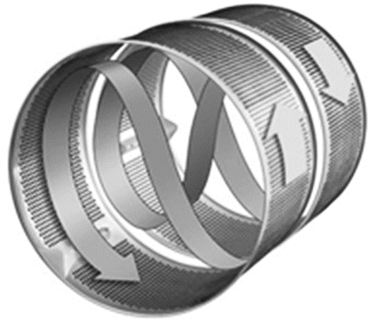
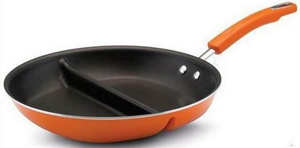
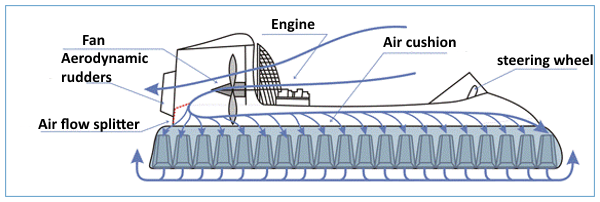

# 40 Thủ thuật 

## Nguyên tắc phân nhỏ

### Định nghĩa

Nguyên tắc này quy định việc phân chia một đối tượng thành một phần với khả năng phân đoạn thành các phân tử hoặc thành một trường.

**Định nghĩa truyền thống:**

- **Chia nhỏ**

- **Làm cho một đối tượng dễ dàng tháo rời;**

- **Tăng mức độ phân khúc của một đối tượng.**

Mức độ phân khúc có thể thay đổi trong một phạm vi khá rộng. Có thể quan sát thấy một chuỗi các biến đổi: một khối lượng bán ra, chia thành hai phần, chia thành nhiều phần, phân đoạn thành các hạt, bột, bột nhão và gel, nhũ tương và hỗn hợp lơ lửng, chất lỏng, bọt, phun và sol khí, khí, plasma, trường , và cuối cùng, trở thành trống rỗng, chân không.

Các quy trình và hoạt động, không gian và khoảng trống, bề mặt và dòng chảy có thể được phân đoạn. Giả sử rằng một vật đang chuyển động là một dòng chất lỏng. Đó là trường hợp, dòng chảy có thể được chia thành hai, sau đó thành nhiều dòng, tiếp tục thành các tia phản lực mỏng, và cuối cùng, được phân đoạn thành một chất lỏng phân tán trong không khí: một sol khí.

Nguyên tắc Phân đoạn thường được áp dụng để có được các nguồn lực cho việc chuyển đổi hệ thống, tách các bộ phận và mang các chức năng mới khỏi các thành phần của hệ thống. Nói chung, nguyên tắc phân đoạn có thể áp dụng được nếu một phần của hệ thống hoặc thành phần của nó phải chịu một tác động bất lợi nào đó: nó có thể được tách ra khỏi toàn bộ thành phần và có thể thay thế được. Các bộ phận này hoặc các thành phần tự biến đổi thường có thể thay đổi phương thức hoạt động và chuyển sang cấp độ phân tử, nguyên tử và trường. Điều quan trọng là việc áp dụng Nguyên tắc Phân đoạn tạo cơ hội để phát triển hệ thống hơn nữa: chỗ ở của các thuộc tính của các bộ phận được phân chia, năng động hóa hoạt động của hệ thống và tăng khả năng kiểm soát.

### VÍ DỤ

**Ví dụ. Nguyên tắc phân đoạn trong thiết kế máy giặt**

```{r fig1, fig1.cap='My Caption',fig.align="center", echo=FALSE, message=FALSE, warning=FALSE}

```

Trống máy giặt Contrarotator của Dyson Appliances được chia thành hai phần. Chúng có thể quay với các tốc độ khác nhau, cùng chiều và hướng về nhau. Điều này cho phép chọn chế độ giặt và vắt cần thiết. Nếu các bộ phận của lồng giặt quay về phía nhau luân phiên đảo ngược chiều quay, máy sẽ không xoay vải mà xoay nó bắt chước chế độ giặt tay. Kết quả là quần áo được giặt sạch hơn và nhanh hơn rất nhiều.


**Ví dụ. Nguyên tắc phân đoạn trong chuyển phát thông điệp**

Tại các thành phố của Hàn Quốc, bạn có thể tìm thấy các đèn hiệu có thông tin về hành động của kẻ thù. Phân đoạn được áp dụng như sau trong trường hợp này. Lãnh thổ của đất nước được chia thành nhiều phần để ngọn lửa được thắp sáng trên một ngọn hải đăng có thể nhìn thấy rõ ràng trên ngọn hải đăng tiếp theo. Điều này cho phép chúng tôi cung cấp thông tin nhanh chóng đến thủ đô. Hệ thống truyền tín hiệu này được triển khai hiện đại là một mạng di động phủ khắp lãnh thổ của một quốc gia.

**Ví dụ. Máy tính như một bộ tay cầm**

```{r fig3, fig1.cap='My Caption',fig.align="center", echo=FALSE, message=FALSE, warning=FALSE}

```

Máy tính gia nhập thị trường với tư cách là một thiết bị đơn lẻ lại được chia thành nhiều bộ phận. Màn hình, bộ phận hệ thống và bộ điều khiển là giai đoạn đầu tiên trong quá trình phân đoạn thiết kế máy tính. Các nhà phát minh Nhật Bản đã tiến thêm một bước nữa. Bằng cách sử dụng công nghệ Bluetooth, họ đã trình bày một máy tính là một tập hợp các vật phẩm giống như tay cầm. Sử dụng các tay cầm này, người dùng có thể lắp ráp một máy tính chức năng. Bàn phím và hình ảnh được chiếu lên bất kỳ bề mặt phẳng nào. Điều này làm cho máy tính đặc biệt nhỏ gọn trong khi vẫn bảo toàn tất cả các chức năng cơ bản của nó.

**Ví dụ. Quadcopter**

```{r fig4, fig1.cap='My Caption',fig.align="center", echo=FALSE, message=FALSE, warning=FALSE}

```

Quadcopter là một bước tiến trong việc phát triển khái niệm về thiết bị nâng thẳng đứng. Quadcopter khác với người tiền nhiệm của nó, trực thăng, ở chỗ có thể hình dung động cơ đẩy của quadcopter là kết quả của việc chia một cánh quạt máy bay trực thăng lớn thành bốn cánh quạt có đường kính nhỏ hơn. Điều này giúp đơn giản hóa thiết kế máy bay một cách đáng kể và cung cấp khả năng điều khiển chuyến bay dễ dàng.

**Ví dụ. Chảo được chia thành các phần**

```{r fig5, echo=FALSE,fig.align="center", message=FALSE, warning=FALSE, fig1.cap='My Caption'}

```

Bạn có thể nấu một món ăn trên chảo rán thông thường. Chảo Avon cho phép nấu hai món ăn khác nhau cùng một lúc. Điều này đạt được bằng cách chia nó với các phân vùng thành hai phần độc lập.

**Ví dụ. Thủy phi cơ**

```{r fig6, fig1.cap='My Caption',fig.align="center", echo=FALSE, message=FALSE, warning=FALSE}

```

Nhiều địa hình tồn tại như đầm lầy, mặt nước, băng mỏng hoặc vỡ, nơi bánh xe thông thường không thể chạy. Có một bánh xe được "phân đoạn" thành các phân tử chạy tốt. Một luồng phân tử không khí được tăng tốc bởi những chiếc quạt mạnh được sử dụng làm động cơ và hỗ trợ của thủy phi cơ.


## Nguyên tắc tách

Kỹ thuật này là một biến thể của Nguyên tắc Phân đoạn và quy định việc tách một bộ phận ra khỏi đối tượng để đặt nó trong những điều kiện thuận lợi nhất cho hoạt động của toàn bộ hệ thống.

### Định nghĩa truyền thống

**Loại bỏ một phần gây nhiễu (thuộc tính) khỏi đối tượng hoặc ngược lại, tách phần cần thiết duy nhất (thuộc tính).**

Việc áp dụng nguyên tắc này phần lớn phụ thuộc vào hoàn cảnh hiện tại và cần thiết. Sẽ xảy ra rằng chúng ta phải làm điều gì đó nhưng không thể hoặc không thể áp dụng toàn bộ hệ thống cho mục đích đó. Nó tốn kém và phức tạp hoặc ứng dụng hệ thống bị hạn chế bởi các yếu tố có hại dẫn đến hoặc hệ thống không thể thực hiện các hành động cần thiết về mặt kỹ thuật. Trong trường hợp này, cần phải tách bộ phận cần thiết của nó ra khỏi hệ thống để thực hiện hành động cần thiết và xem xét khả năng hoạt động của nó riêng biệt với hệ thống. Trong các tình huống, hệ thống cung cấp năng lượng cho phần được tách ra và hoạt động như một thiết bị điều khiển.

Tình huống có thể xảy ra khi một bộ phận của hệ thống tạo ra hiện tượng có hại, can thiệp vào hoạt động của toàn bộ hệ thống. Điều này có thể bao gồm các hiện tượng xảy ra trong quá trình vận hành hệ thống: tiếng ồn, quá tải nhiệt của các bộ phận, tiếp xúc với hóa chất độc hại, ... Một bộ phận của hệ thống có thể gây ra hư hỏng do tồn tại trong cấu trúc hệ thống: chiếm chỗ, không thuận tiện trong bảo trì và sửa chữa, ảnh hưởng xấu đến các bộ phận khác của hệ thống,… Trong trường hợp này, nên di dời bộ phận bị rối loạn chức năng của hệ thống đến nơi mà tác hại nó sinh ra sẽ không ảnh hưởng đến tình trạng và hoạt động của toàn bộ hệ thống.

Khi áp dụng Nguyên tắc Tách biệt, có thể xem xét không chỉ các thành phần của hệ thống mà còn cả các hoạt động và quá trình được thực hiện. Điều gì cần xem xét tùy thuộc vào từng trường hợp cụ thể phát sinh khi giải quyết vấn đề.

Nguyên tắc Tách biệt được áp dụng để tạo ra một cấu trúc hợp lý mới của hệ thống phù hợp hơn với hoạt động của nó. Khi áp dụng nguyên tắc, cần phải cân bằng triệt để hệ thống, các thuộc tính của nó, tính năng động và khả năng điều khiển ngay từ đầu.

### VÍ DỤ

**Ví dụ. Máy tính có màn hình có thể tháo rời**

Màn hình là một bộ phận thiết yếu, một thành phần hoạt động của máy tính. Tách thành phần hoạt động của nó, các nhà phát triển cho phép người dùng sử dụng nó một cách thuận tiện. Bạn có thể treo một màn hình có thể tháo rời lên tường để thuyết trình. Nếu nó được trang bị bộ nhớ tối thiểu và bộ xử lý đơn giản, bạn có thể mang theo khi đi du lịch.

**Ví dụ. Máy lạnh mặt đất**

Nếu nhiệt độ không khí cao, tại sân bay xảy ra sự cố làm mát khoang máy bay. Nếu bạn sử dụng bộ phận điều hòa không khí của máy bay, bạn sẽ bị cháy rất ít tác dụng vì bộ phận này chỉ hoạt động khi động cơ đang hoạt động. Để làm mát máy bay trên mặt đất kịp thời và hiệu quả, thiết bị này sẽ được gỡ bỏ khỏi hệ thống, tức là sử dụng thiết bị điều hòa không khí mặt đất trên phương tiện hoặc phương tiện tĩnh.

**Ví dụ. UAV trinh sát**

Khi điều khiển xe trên đường đông đúc hoặc trong các điều kiện lái xe phức tạp khác, điều quan trọng là phải biết tình hình giao thông phía trước. Để giải quyết vấn đề này, một robot bay, một quadcopter, đã được sử dụng. Robot được phóng lên không trung và di chuyển phía trước xe, truyền tình hình giao thông đến màn hình hiển thị của người lái.

**Ví dụ. Ăng ten parafoil kéo**

Hoạt động của ăng-ten trên tàu phụ thuộc rất nhiều vào độ cao của nó. Do đó, hệ thống TALONS dường như được quan tâm, nó cung cấp khả năng đưa ăng ten lên cao hơn nhiều trong khi sử dụng một cánh được làm dưới dạng parafoil. Áp dụng một ý tưởng như vậy có thể tăng phạm vi của các hệ thống thông tin liên lạc vì không có con tàu nào được trang bị cột buồm ở độ cao này.

**Ví dụ. Nhà máy đồng phát**

Các nhà máy cung cấp nhiệt và điện cho khu vực đô thị (nhà máy đồng phát) đốt than, nhiên liệu dầu, khí đốt và các nhiên liệu hóa thạch khác. Điều này dẫn đến khí thải gây ô nhiễm: khói, các hạt khói và carbon monoxide. Do đó, các nhà máy đồng phát được đưa đi và đặt ở một khoảng cách an toàn với các công trình dân cư.

## Nguyên tắc chất lượng cục bộ

Nguyên tắc Chất lượng cục bộ cũng dựa trên Nguyên tắc Phân đoạn và quy định việc tách một thành phần hoặc một hệ thống thành các vùng chức năng, mỗi vùng có các đặc tính khác nhau phù hợp nhất cho hoạt động của hệ thống.

### Định nghĩa truyền thống của nguyên tắc:

Thay đổi cấu trúc đối tượng (hoặc môi trường bên ngoài, ảnh hưởng bên ngoài) thành không đồng nhất.
Các bộ phận khác nhau của đối tượng nên có (thực hiện) các chức năng khác nhau.
Mỗi bộ phận của đối tượng cần được đặt trong những điều kiện thích hợp nhất cho hoạt động của nó.
Thông thường, chúng ta thấy rằng hoặc các yêu cầu xung đột được áp đặt trên cùng một thành phần hệ thống hoặc hệ thống phải thực hiện các chức năng khác nhau. Trong trường hợp này, nên chia thành phần thành các phần, mỗi phần phải được cung cấp các thuộc tính cần thiết để đáp ứng các yêu cầu khác nhau và để thực hiện các chức năng cần thiết.

Cụ thể, thuyền không chỉ không thấm nước mà còn phải chắc chắn để giữ được hình dáng thuyền. Nó có nghĩa là các mặt phải chống thấm nước và đủ chắc chắn. Để đáp ứng các yêu cầu xung đột như vậy đối với một thành phần, cần phải thỏa hiệp về các thuộc tính hữu ích của nó. Những chiếc thuyền đầu tiên được khoét trực tiếp từ các thân cây, chúng nặng và di chuyển chậm.

Tình hình có thể được cải thiện đáng kể bằng cách chia thành phần thành các phần có các thuộc tính khác nhau. Điều này cho phép đáp ứng tốt hơn các yêu cầu của từng bộ phận của hệ thống do các điều kiện hoạt động của nó. Cụ thể, thiết kế truyền thống của thân tàu hoặc thuyền sử dụng khung chịu lực: khung, khung dọc, ke, ... Khung này cung cấp cho thân tàu một độ bền cần thiết. Để tránh rò rỉ, lớp mạ của vật liệu chống thấm mỏng được gắn vào khung. Điều này đảm bảo chất lượng địa phương: khung có độ bền cao và lớp mạ ngăn rò rỉ.

Nguyên tắc chất lượng cục bộ có thể được sử dụng cho các thành phần của hệ thống cũng như cho các hoạt động của quy trình kỹ thuật. Khi phân tích các thành phần, chúng ta nên tập trung vào phân tích và chuyển đổi các thuộc tính của chúng, và khi làm việc với các quy trình, về hiệu suất của chúng.

### VÍ DỤ

**Ví dụ. Cứng răng bánh răng**

Các yêu cầu mâu thuẫn được đặt ra đối với kết cấu bánh răng. Bản thân bánh răng phải mềm dẻo để tránh nứt vỡ và làm cho nó chạy nhẹ nhàng và mượt mà hơn. Đối với răng bánh răng, chúng phải có bề mặt cứng, chống mài mòn tốt. Để đạt được mục đích đó, nhiều phương pháp khác nhau được sử dụng: cacbon hóa, làm cứng bề mặt răng, làm cứng bề ngoài bánh răng bằng cách sử dụng dòng điện tần số cao, v.v.


**Ví dụ. Chiếu sáng đường băng**

Khi hạ cánh vào ban đêm, phi công cần nhìn rõ đường băng sân bay. Giải pháp rõ ràng là chiếu sáng đường băng bằng đèn chiếu sáng hoặc đèn pha mạnh. Tuy nhiên, việc chiếu sáng này khá tốn kém nên đường băng chỉ được chiếu sáng ở một số nơi. Để chỉ ra giới hạn và hướng của đường băng, đèn pin và chuỗi đèn đứt nét được sử dụng và điều này dường như là đủ.


**Ví dụ. Xe van đa năng**

Thùng tủ lạnh tồn tại để vận chuyển hàng hóa dễ hư hỏng trong thời tiết nắng nóng. Đồng thời, một phần của hàng hóa yêu cầu nhiệt độ trên 0, ngay cả trong mùa đông. Để vận chuyển đồng thời hàng hóa cần làm mát và hàng hóa cần sưởi ấm trong một xe, xe van được chia thành hai phần với các đặc tính khác nhau. Một phần của van được làm mát, và phần khác được làm nóng. Để đơn giản thay đổi chế độ nhiệt độ, bộ làm mát nhiệt điện có thể làm nóng hoặc làm mát với phân cực điện áp thay đổi được sử dụng.


## Nguyên tắc thay đổi đối xứng

Nguyên tắc Thay đổi Đối xứng quy định sự thay đổi về hình dạng thành phần hoặc cấu trúc và bố cục hệ thống.

### Định nghĩa truyền thống của nguyên tắc:

Thay đổi hình dạng của một đối tượng từ đối xứng sang không đối xứng;
Nếu một vật thể không đối xứng, hãy tăng mức độ bất đối xứng của nó.
Hình dạng đối xứng của các đối tượng là phổ biến nhất, trực giác của con người cố gắng làm cho một đối tượng giống nhau về hai hoặc nhiều mặt. Trong trường hợp này, quán tính tâm lý và tính toán đơn giản hoạt động: khi làm việc một mặt của thành phần, người ta không cần phải suy nghĩ về các tham số của mặt thứ hai và cho rằng chúng giống nhau. Tuy nhiên, cách tiếp cận này ngay lập tức ngừng hoạt động khi chúng ta thấy có sự phân biệt rõ ràng trong các yêu cầu đối với từng mặt của hệ thống hoặc thành phần của nó. Ví dụ, con thuyền đối xứng trong mặt phẳng dọc và dọc, mặt trái là sự phản chiếu đều đặn của mặt phải. Cách tiếp cận này hoạt động tốt nếu thành phần hoặc hệ thống được cách ly và không có yêu cầu bổ sung nào được áp đặt lên các thành phần và siêu hệ thống khác. Điều này không phải lúc nào cũng đúng như vậy, các yêu cầu mâu thuẫn khó thỏa mãn luôn được áp đặt cho dạng thành phần. Tình huống đơn giản hóa đáng kể nếu thành phần được làm không đối xứng, tức là các yêu cầu khác nhau đối với các phần bên phải và bên trái của thành phần được xem xét. Điều này mang lại khả năng điều chỉnh tốt hơn hình thức đối tượng phù hợp với các điều kiện hoạt động của nó.

Nguyên tắc Thay đổi Đối xứng có hiệu lực cho cả các thành phần của hệ thống và cho các hành động được thực hiện trong quá trình làm việc của nó. Nó thể hiện cách điều chỉnh tốt hơn hình thức và các thông số khác của thành phần hệ thống với các thành phần khác và điều kiện hoạt động của chúng. Thường thì hình thức không đối xứng và làm cho quá trình diễn ra không đều cho phép tạo ra các dao động giả không phù hợp và các hiệu ứng bất lợi khác.

### VÍ DỤ

**Ví dụ. Cánh quạt**

Hình dạng cánh quạt của những chiếc quạt gia dụng đầu tiên đối xứng về trục cánh quạt, điều này khiến chúng ồn ào và kém hiệu quả. Thực tế là các yêu cầu khác nhau được đặt ra đối với các cạnh trước và sau của các lưỡi dao. Trong quá trình phát triển của công nghệ, hình dạng lưỡi kiếm đã trở nên không đối xứng, giống như cánh của con dơi. Các cạnh trước và sau của lưỡi dao cũng được làm khác nhau. Mép trước trơn nhẵn, mép sau có các răng siêu nhỏ giúp phá vỡ luồng không khí và giảm tiếng ồn.


**Ví dụ. Máy bay trinh sát**

Thiết kế máy bay trinh sát cần đảm bảo rằng người quan sát có tầm nhìn cao nhưng các yếu tố cấu trúc gây trở ngại cho nó. Do đó, các nhà thiết kế của Blohm & Voss quyết định làm cho chiếc máy bay không đối xứng. Máy bay BV 141 có cabin quan sát viên dịch chuyển sang bên phải so với thân máy bay và phần phụ được dỡ bỏ bên phải. Vị trí cabin này mang lại tầm nhìn tốt.


**Ví dụ. Mã hóa bất đối xứng**

Mã hóa một tài liệu là một bước quan trọng trong giao tiếp thông tin bí mật. Mã hóa đối xứng thường được sử dụng cung cấp rằng người nhận có cùng một khóa để giải mã như khóa mà người gửi tài liệu được mã hóa có. Điều này làm giảm tính bảo mật của thông tin liên lạc dữ liệu. Trong trường hợp mã hóa không đối xứng, hai khóa khác nhau được sử dụng: một để mã hóa (còn được gọi là “khóa công khai”) và khóa còn lại để giải mã (được gọi là “khóa riêng”). Điều này làm tăng đáng kể độ tin cậy của giao tiếp dữ liệu.


**Ví dụ. Tàu sân bay**

Sàn tàu sân bay cần được điều chỉnh phù hợp với cả điều kiện cho máy bay cất và hạ cánh. Quá trình cất cánh đòi hỏi một đường băng dài, trên đó có lắp đặt tên lửa đẩy hoặc máy phóng cất cánh. Máy bay có thể hạ cánh trên một đường băng ngắn được trang bị hệ thống chống sét. Tình hình phức tạp bởi yêu cầu máy bay cất và hạ cánh cùng một lúc. Mâu thuẫn này được giải quyết bằng cách làm cho sàn đáp không đối xứng: đường băng cất cánh nằm dọc theo trục tàu, còn đường băng hạ cánh nằm nghiêng một góc.


**Ví dụ. Đai ốc không đối xứng**

Điểm gắn thanh ray và tà vẹt phải chịu lực rung và va đập cực mạnh, do đó các đai ốc giữ có thể bị lỏng ra. Để giải quyết hiện tượng này, người ta đã thiết kế một giá đỡ bu lông có đai ốc tự bảo vệ. Đai ốc bên trong có hình nón trên đỉnh được lắp đặt không đối xứng với trục quay bị lệch. Đai ốc bên ngoài có một vết cắt hình nón nằm ở trục quay của đai ốc. Khi đai ốc trên được vặn vào, hình nón không đối xứng sẽ dịch chuyển nó sang một bên, một cụm tự bảo vệ được hình thành.

## Nguyên tắc hợp nhất

Nguyên tắc Hợp nhất có nghĩa là mâu thuẫn có thể được giải quyết bằng cách hợp nhất một số thành phần của hệ thống hoặc các hoạt động mà nó thực hiện.

### Định nghĩa truyền thống của nguyên tắc:

Hợp nhất các đối tượng giống hệt nhau hoặc các đối tượng dành cho các hoạt động liền kề.
Thực hiện song song các hoạt động giống hệt nhau hoặc liền kề.
Trong một thiết kế hệ thống, quán tính tâm lý đang hoạt động, nó gợi ý rằng: mỗi chức năng được thực hiện nên có người thực hiện riêng. Điều này dẫn đến sự phức tạp của hệ thống, thành phần và cấu trúc của nó có thể và cần được đơn giản hóa. Điều này có thể được thực hiện bằng cách xem xét khả năng hợp nhất của một số thành phần. Kết quả là một thành phần đa năng có thể thực hiện một số chức năng.

Một hiệu ứng mới về chất lượng thường được yêu cầu nhưng điều này không thể thực hiện được khi sử dụng một thành phần duy nhất, sau đó một thành phần khác được thêm vào nó. Một hệ thống tích hợp như vậy được gọi là bisystem. Ngoài việc tăng năng suất, một hệ thống kép có thể có các thuộc tính hoàn toàn mới khác với các thuộc tính của một hệ thống thông thường, thường cho phép thực hiện các hành động trước đây không có sẵn. Hợp nhất được hiểu trong trường hợp này không chỉ và không nhiều như sự hợp nhất cơ học của hai hệ thống. Nó đúng hơn là một tổ chức sử dụng chung để thực hiện chức năng cần thiết.

Cách tiếp cận tương tự có thể được áp dụng cho các hoạt động làm việc. Trong trường hợp này, chúng được kết hợp với nhau theo thời gian, tức là một số hoạt động được thực hiện song song cùng một lúc. Điều này cho phép cải thiện đáng kể hiệu suất hệ thống và giảm thời gian giao sản phẩm. Một ví dụ cụ thể của hoạt động hợp nhất là việc hợp nhất liên tiếp một số hệ thống (hoạt động làm việc) để tăng tầm quan trọng của một tham số hoạt động quan trọng. Điều này xảy ra bởi vì năng lượng hoặc tích lũy trong các hoạt động trước đó hoặc hiện diện trong hệ thống ở dạng tích lũy được sử dụng ở mỗi giai đoạn của quá trình. Hành động nhiều giai đoạn có một số ưu điểm so với hành động một giai đoạn vì nó cho phép giảm đáng kể mức tiêu thụ năng lượng để hoàn thành quy trình.

Hợp nhất một số hệ thống cho phép tạo ra hiệu ứng hệ thống, các thuộc tính tích cực bổ sung không có trong mỗi hệ thống được hợp nhất. Tương tự, hợp nhất các hệ thống có thể giúp tránh các tác động bất lợi.

Nguyên tắc Hợp nhất hoạt động tốt khi kết hợp với Nguyên tắc Phân đoạn. Vì vậy, để xây dựng công trình, ban đầu vật liệu được nghiền thành bột, trộn thêm xi măng, vật liệu đó hòa quyện lại thành chất lượng mới được. Ở cấp độ vi mô, bó này được biểu thị như sự phân ly và liên kết của các phân tử của một chất vật chất. Quá trình chuyển đổi tuyên bố việc sử dụng sự phân ly của các hợp chất để phân đoạn của chúng thành các thành phần đơn giản, đến lượt chúng, có thể được sử dụng để hợp nhất (liên kết) các chất mới mà không thể đưa vào quá trình vì một số lý do. Bó phân ly và liên kết có thể được coi là sự phân đoạn và hợp nhất ở cấp độ phân tử.

### VÍ DỤ

**Ví dụ. Xe tải**

Việc vận chuyển các loại hàng hóa khác nhau bằng xe tải nặng đòi hỏi người lái xe phải nỗ lực rất nhiều. Có thể giảm chi phí lao động bằng cách kết hợp xe tải thành các loại đoàn tàu. Xe phía trước được điều khiển bởi người lái và những chiếc sau bằng hệ thống điều khiển tự động sao chép các thao tác của xe phía trước.


**Ví dụ. Kéo nhiều lưỡi**

Thật tiện lợi để cắt salad bằng kéo nhưng một cặp lưỡi dao không đủ hiệu quả. Nhược điểm này được giải quyết bằng cách lắp song song một số cặp lưỡi cắt. Những chiếc kéo multiblade như vậy được hoạt động như bình thường với hai vòng.

**Ví dụ. Ghế máy bay hạng nhẹ**

Đối với máy bay hạng nhẹ công suất thấp, trọng lượng của các thành phần thiết kế là rất quan trọng. Để làm cho máy bay nhẹ hơn, thùng nhiên liệu và chỗ ngồi của phi công đã được hợp nhất.


**Ví dụ. Gian hàng tắm**

Hệ thống vòi tắm bao gồm ống nước, máy phun sương, ống treo rèm, ống treo rèm. Ý tưởng là hợp nhất các ống nước và ống cho rèm. Đường ống được làm dưới dạng một chiếc vòng, và rèm được gắn vào nó.


**Ví dụ. Áo khoác năng lượng mặt trời**

Hệ thống năng lượng điện thoại thông minh bao gồm một mảng năng lượng mặt trời tạo ra năng lượng để sạc pin. Nhược điểm là mảng khó sử dụng khi đi bộ. Vấn đề này được giải quyết bằng cách gắn trực tiếp các mảng năng lượng mặt trời vào quần áo.


**Ví dụ. Thớt có vảy**

Khi nấu, điều quan trọng là phải biết khối lượng của các nguyên liệu được sử dụng, vì vậy chúng nên được cân. Ý tưởng là hợp nhất thớt với cân điện tử. Bây giờ bạn có thể tìm hiểu trọng lượng thực phẩm trực tiếp khi bạn cắt nó.


**Ví dụ. Bộ điều khiển nhiệt độ lưỡng kim**

Nếu hai dải, ví dụ: sắt và đồng, được hợp nhất trong một bisystem, một cái gọi là dải lưỡng kim được tạo ra. Khi bị nung nóng, một dải như vậy sẽ uốn cong do thực tế là một trong các dải nở ra nhiều hơn dải kia. Tính chất này của dải lưỡng kim được sử dụng rộng rãi để đo và kiểm soát nhiệt độ.

## Nguyên tắc đa chức năng

Nguyên tắc Đa chức năng có liên quan chặt chẽ với Nguyên tắc Hợp nhất. Đó là kết quả của việc hợp nhất một số thành phần mà chúng ta có được một thành phần đa chức năng của hệ thống có thể thực hiện một số chức năng.

### Định nghĩa truyền thống của nguyên tắc:

Một đối tượng thực hiện nhiều chức năng do đó không cần các đối tượng khác.

Có được một thành phần đa chức năng thực hiện một số chức năng là mục tiêu và kết quả của việc áp dụng Nguyên tắc Hợp nhất. Sự khác biệt nằm ở chỗ, trong Nguyên tắc Đa chức năng, chúng ta không xem xét quá trình hợp nhất một số thành phần mà là kết quả của sự biến đổi này - một thành phần đa chức năng. Chúng tôi xem xét liệu một thành phần của hệ thống có thể thực hiện không chỉ chức năng của nó mà còn các chức năng liền kề phù hợp với nó hay không. Trên thực tế, nguyên tắc quy định việc tìm cách tăng tính lý tưởng của hệ thống.

Ngoài các chức năng đã được thực hiện trong hệ thống, thành phần đa chức năng cũng có thể thực hiện một số chức năng hữu ích mới được đưa vào hệ thống. Đó là trong trường hợp này, chúng tôi không thực hiện toàn bộ chuỗi biến đổi "Giới thiệu một thành phần, vật mang của một chức năng mới, loại bỏ một đối tượng và đảm bảo chức năng với các thành phần còn lại." Chúng tôi cố gắng tìm hiểu ngay xem liệu có thể thêm một chức năng mới vào thành phần hay không, liệu nó có thể trở nên đa chức năng hay không.

Nguyên tắc Đa chức năng nhằm giảm chi phí hệ thống trong khi vẫn bảo toàn chức năng của nó. Nó được áp dụng tương tự như Nguyên tắc hợp nhất khi cần cắt giảm chi phí hệ thống, thu nhỏ quy mô. Sự cần thiết có thể nảy sinh từ tuyên bố vấn đề hoặc khi các thành phần mới được đưa vào trong quá trình giải quyết vấn đề.

### VÍ DỤ

**Ví dụ. Quả tạ chai**

Một chai nhựa coke bị thu hẹp ở phần trung tâm. Khi chai đã cạn, bạn có thể đổ nước hoặc đổ cát vào để sử dụng như một quả tạ.


**Ví dụ. Điện thoại thông minh**

Các thiết bị điện tử hiện đại có tính đa chức năng cao. Cụ thể, một chiếc điện thoại thông minh có thể thay thế nhiều thiết bị điện tử: điện thoại, máy ảnh, máy quay phim, máy tính, các thiết bị ghi âm, v.v.


**Ví dụ. Bộ đồ ăn**

Đũa rất tiện lợi cho nhiều món ăn khác nhau nhưng việc sử dụng chúng đòi hỏi một số kỹ năng. Vì vậy, ý tưởng là sử dụng bộ đồ ăn đa chức năng: đũa với nĩa và dao. Để làm điều này, các đầu lỏng lẻo của đũa được làm dưới dạng ngạnh và một lưỡi dao.


**Ví dụ. Công cụ kết hợp**

Các công cụ có thể thay thế cho nhau rất đa chức năng và có thể được sử dụng trong nhiều ứng dụng khác nhau. Cụ thể, tuốc nơ vít bánh cóc có một bộ đầu có thể thay thế cho nhau để làm việc với ốc vít và bu lông.

**Ví dụ. Cờ lê cho bất kỳ bu lông nào**

Đầu cờ lê là một bộ chốt có lò xo nằm trong vỏ. Việc phân đoạn đầu này thành các chốt và sự hợp nhất sau đó của chúng cho phép khớp bất kỳ bu lông nào.


## Nguyên tắc chứa trong

Nguyên tắc chứa trong quy định việc sử dụng không gian một cách tối đa khi sắp xếp một hệ thống.

### Định nghĩa truyền thống của nguyên tắc:

Một đối tượng được đặt bên trong một đối tượng khác, đến lượt nó, lại nằm bên trong đối tượng thứ ba, v.v.

Một đối tượng đi qua một khoang trong một đối tượng khác.
Nguyên tắc lồng ghép nhằm mục đích tăng tính nhỏ gọn của hệ thống. Nguyên tắc quy định hoặc đặt một thành phần bên trong một thành phần khác khi bố trí một hệ thống hoặc làm cho một thành phần đi qua các hốc hoặc khe rỗng của thành phần khác. Trong mọi trường hợp, nguyên tắc là nhằm loại bỏ không gian trống trong hệ thống, sắp xếp dày đặc hơn Để đảm bảo sự sắp xếp này, không gian thường để trống được sử dụng. Một phương pháp khác là cố ý tạo ra các khoảng rỗng để đặt các thành phần bổ sung. Vì vậy, không gian bên dưới một khu dân cư hoặc công trình công nghiệp thường chiếm trên mặt đất thường được sử dụng làm bãi đậu xe. Cải tạo là tối thiểu, và những lợi ích trong thành phố là đáng kể.

Việc sử dụng Nguyên tắc lồng ghép cho phép làm cho một hệ thống nhỏ hơn, điều này thường dẫn đến lợi thế về chi phí thấp hơn và đôi khi là yếu tố quyết định. Trong mọi trường hợp, một hệ thống nhỏ gọn có mức độ lý tưởng cao hơn.

### VÍ DỤ

**Ví dụ. Mở rộng đoạn Trailer cắm trại**

Một chiếc xe kéo cắm trại nên có kích thước tương đối lớn. Tuy nhiên, kích thước của nó bị giới hạn bởi các quy định giao thông. Trailer Bauer 3X được vận chuyển thu lại như một con búp bê lồng vào nhau, hai mô-đun sống khác được đặt ở trung tâm của nó.


**Ví dụ. Bảo quản ghế**

Ghế bổ sung được sử dụng khi khách đến thăm yêu cầu không gian lưu trữ. Chúng được thiết kế để những chiếc ghế có thể được lắp vào nhau. Do đó, chúng chiếm ít không gian.


**Ví dụ. Bánh đà siêu**

Bánh đà siêu quay trong chân không với tần suất hàng trăm nghìn vòng / phút tích lũy năng lượng cơ học một cách hiệu quả. Vấn đề là làm thế nào để trích xuất năng lượng quay từ buồng chân không. Ý tưởng là đặt một bánh đà bên trong một bánh đà khác, đó là một hộp chứa khử mùi quay. Chuyển động quay được thực hiện bằng cách ăn khớp của bánh răng bánh đà với bánh răng vòng của vỏ.

**Ví dụ. Máy bay trực thăng**

Cánh quạt ổn định của máy bay trực thăng có thể chống chướng ngại vật khi hạ cánh. Ý tưởng là đặt cánh quạt ổn định bên trong một vòng đệm được làm ở phần đuôi của máy bay trực thăng.

**Ví dụ. Tủ bên trong cầu thang**

Nguyên tắc làm tổ được sử dụng rộng rãi trong thiết kế và sản xuất đồ nội thất. Một ví dụ là tủ lưu trữ được đặt bên trong cầu thang.

**Ví dụ. Dây chuyền băng tải quay**

Một dây chuyền băng tải quay có thể là một ví dụ về nguyên tắc làm tổ trong sản xuất. Cụ thể, hoạt động “chuyển động của các bộ phận” bao gồm các hoạt động xử lý của chúng. Mỗi hoạt động xử lý, đến lượt nó, bao gồm một số hành động tương đối đơn giản.

## Nguyên tắc 8. Nguyên tắc bù trọng lượng

Nguyên tắc bù trọng lượng quy định rằng việc bù trọng lượng kết cấu có thể mang lại lợi thế đáng kể trong hoạt động của hệ thống.

### Định nghĩa truyền thống của nguyên tắc:

Bù lại trọng lượng của một vật bằng cách hợp nhất vật đó với các vật khác để tạo lực nâng.
Bù lại trọng lượng của một vật bằng cách làm cho vật đó tương tác với môi trường (bằng cách sử dụng các lực khí, thủy động lực học và các lực khác).
Nguyên tắc Bù trọng lượng có nghĩa là sử dụng lực nâng tác động lên một vật thể, ngay từ đầu. Thang máy có thể được tạo ra bởi một hệ thống bổ sung hoặc bởi chính môi trường nơi hành động diễn ra.

Trong trường hợp đầu tiên, hệ thống cung cấp cho việc giới thiệu một thành phần bổ sung, ví dụ: một cánh, một quả bóng bay, một cánh quạt hoặc một máy bay phản lực. Ngoài các thành phần chất, các thành phần trường, ví dụ: một từ trường cho các thành phần sắt từ, có thể được sử dụng. Hệ thống này hoặc nguyên tắc bù trọng lượng thành phần của nó yêu cầu mở rộng hệ thống.

Nếu chúng tôi cung cấp lực nâng của thành phần hệ thống bằng chính môi trường, các giải pháp kết quả sẽ gần với các giải pháp lý tưởng hơn. Trong trường hợp này, việc giới thiệu các thành phần mới là không cần thiết, thang máy xảy ra do sự tương tác giữa các thành phần hệ thống và môi trường.

Việc sử dụng Nguyên tắc bù trọng lượng cho phép tăng đáng kể tốc độ và năng suất của các hệ thống nặng, để giảm tải và lực gây ra.

### VÍ DỤ

**Ví dụ. Thủy phi cơ**

Luồng không khí do quạt tạo ra lực nâng cho thủy phi cơ. Không khí được dẫn xuống dưới đáy, nơi nó làm phồng vỏ linh hoạt và tồn tại trong một dòng chảy mỏng dọc theo chu vi của nó, giữ cho thủy phi cơ cách mặt đất vài cm.

**Ví dụ. Mang ma sát**

Vòng bi phân đoạn có thiết kế đơn giản: nó là một ống lót có trục quay bên trong. Một lớp mỡ được bôi vào giữa trục và ống lót, nó tạo ra lực nâng thủy động cho trục. Khi quay, trục chạy trên một lớp dầu mỡ và nâng lên khi đạt đến một tốc độ nhất định đồng thời hình thành cái gọi là "nêm màng dầu". Sau đó, trục không tiếp xúc với bề mặt ống lót và chỉ nằm trên lớp dầu mỡ.

Ví dụ. Đầu đọc của ổ đĩa cứng

Bề mặt ổ đĩa cứng máy tính không được tiếp xúc với đầu đọc để tránh hư hỏng. Để đạt được điều này, một thanh trượt được lắp ở cuối đầu, nó nâng đầu lên trên bề mặt đĩa 5-10 nanomet. Khi đĩa quay không khí dưới thanh trượt tạo ra một đệm khí hỗ trợ cho đầu bay song song với bề mặt. Bản thân bề mặt của thanh trượt không bằng phẳng, nó có các rãnh khí động học giúp ổn định độ cao khi bay.

**Ví dụ. Tàu Maglev**

Lực cản lăn của bánh xe lửa tiêu tốn nhiều năng lượng và không cho phép chạy với tốc độ cao. Để loại bỏ lực cản này, một tàu bay từ trường đã được thiết kế. Trong đoàn tàu này, lực nâng được tạo ra bởi sự tương tác của từ trường giữa đoàn tàu và đường ray. Do có khoảng trống giữa tàu và mặt đường nên ma sát của chúng bị loại trừ và lực duy nhất làm giảm tốc tàu là lực cản khí động học.

**Ví dụ. Cách tiết kiệm núm vú giả**

Núm vú giả của trẻ là một nguồn gây ra nhiều rắc rối cho các bậc cha mẹ. Em bé coi núm vú giả như một món đồ chơi và có thể ném nó xuống sàn nơi núm vú giả có thể rơi xuống đất hoặc bị lạc. Mẹo nhỏ là bạn hãy gắn núm vú giả vào một quả bóng bay trên một đoạn ren dài.

**Ví dụ. Tàu cánh ngầm**

Một con tàu chìm trong nước sẽ chống lại chuyển động rất nhiều. Để giảm lực cản, người ta sử dụng phương pháp động lực học để giữ bình ở trên mặt nước. Dưới thân tàu bố trí các cánh ngầm tạo lực nâng và nâng thân tàu lên trên mặt nước. Điều này cho phép giảm đáng kể lực cản đối với chuyển động và cho phép đạt được tốc độ mà các thuyền dịch chuyển thông thường không thể đạt được.

## Nguyên tắc 9. Nguyên tắc đếm sơ bộ

Nguyên tắc tính toán sơ bộ quy định việc thực hiện một hành động trái với hành động được yêu cầu để cải thiện các điều kiện hoạt động của hệ thống.

### Định nghĩa truyền thống của nguyên tắc:

Tạo ra những căng thẳng trong một đối tượng chống lại những căng thẳng làm việc không thể chấp nhận được hoặc không mong muốn từ trước.
Nếu tuyên bố vấn đề yêu cầu thực hiện một hành động, thì cần phải thực hiện một phản ứng trước.
Nguyên tắc Phản hồi Sơ bộ cho thấy rằng, trước khi thực hiện hành động chính, thường có thể thực hiện một hành động trái với hành động được yêu cầu. Điều này đề cập đến ứng suất cơ học, dao động nhiệt độ và áp suất, v.v. Cụ thể, nước được làm nóng trước đóng băng nhanh hơn nước lạnh. Để san bằng và lu lèn đường đất, trước tiên cần nới lỏng đường đất ... Nguyên tắc này là cơ sở của bê tông cốt thép ứng lực trước: để làm cho sản phẩm của nó hoạt động tốt hơn khi căng, cốt thép của chúng được ứng suất trước khi nén. Phản ứng sơ bộ có thể được sử dụng để lưu trữ năng lượng được giải phóng sau này khi thiết bị hoạt động.
Để làm điều gì đó ngược lại với hành động được yêu cầu là một kỹ thuật phổ biến trong kỹ thuật và trong các lĩnh vực hoạt động khác của con người. Để xe bị kẹt thoát ra khỏi lỗ, người lái xe lùi lại trước rồi đưa xe về phía trước lắc đều cho đến khi đạt được kết quả dương tính.

Việc sử dụng Nguyên tắc đếm sơ bộ cho phép tăng cường các thành phần của hệ thống, giảm tiêu thụ năng lượng tải và những nỗ lực trong hoạt động của chúng.

### VÍ DỤ

**Ví dụ. Tháo một đai ốc**

Rất phức tạp để tháo một đai ốc bị rỉ sét không tuân theo nếu người ta cố vặn nó theo hướng không vặn. Việc này sẽ dễ dàng hơn nhiều nếu người ta xoay nhẹ đai ốc theo hướng vặn trước khi tháo và di chuyển đai ốc ra khỏi vị trí của nó. Sau đó, đai ốc mở tương đối dễ dàng.

**Ví dụ. Lực lắp vành**

Việc lắp chặt vành trên trục đòi hỏi nỗ lực đáng kể và một lực nhấn mạnh. Một kỹ thuật thay thế có thể được sử dụng: tạo lực căng ngược lại với lực căng nén trục đang hoạt động trong vành. Để làm điều này, vành được kéo dài đến tốc độ cao, lực ly tâm làm mở rộng lỗ và vành lắp trục dễ dàng. Sau khi vòng quay dừng lại, vành vừa khít.

**Ví dụ. Máy bắn đá**

Vũ khí ném, cung hoặc máy phóng, sử dụng năng lượng được lưu trữ trong các thành phần đàn hồi. Để bắn từ máy phóng, trước tiên cần thực hiện hành động ngược lại, tức là kéo căng dây cao su.

**Ví dụ. Tích lũy**

Hoạt động của bộ tích lũy là sự phóng điện của nó khi sử dụng năng lượng để cung cấp năng lượng cho người tiêu dùng. Chu kỳ hoạt động của bộ tích lũy yêu cầu phản hồi trước, tức là bộ tích lũy phải được sạc trước khi sử dụng.

**Ví dụ. Nến**

Một ngọn nến đang cháy sẽ làm nóng không khí xung quanh, nó nóng lên và tan chảy. Nếu nến được làm lạnh trước, chẳng hạn như được đặt vào tủ đông trước khi sử dụng, nến sẽ cháy lâu hơn nữa.

## Nguyên tắc 10. Nguyên tắc hành động sơ bộ

Nguyên tắc Hành động Sơ bộ quy định rằng nên thực hiện tất cả các hoạt động chuẩn bị có thể có trước khi bắt đầu hành động chính.

### Định nghĩa truyền thống của nguyên tắc:

Thực hiện thay đổi cần thiết của một đối tượng (toàn bộ hoặc ít nhất một phần).
Sắp xếp trước các đối tượng để chúng có thể hoạt động từ nơi thuận tiện nhất và không mất thời gian giao hàng.
Nguyên tắc Hành động Sơ bộ ngụ ý tầm quan trọng của công việc chuẩn bị. Tốt nhất, cần phải giảm thiểu hiệu suất của hành động chính sau khi hoàn thành trước tất cả các thao tác có thể. Trước hết, điều này cho phép giảm đáng kể thời gian của chính quá trình sản xuất. Tất cả các hoạt động sơ bộ có thể được thực hiện vào thời điểm thuận tiện bằng cách sử dụng thiết bị và công nghệ hiệu quả nhất. Trong trường hợp này, cần thời gian tối thiểu để lắp ráp và đưa hệ thống vào trạng thái làm việc. Về cơ bản, nguyên tắc quy định phân phối thời gian đồng đều hơn bằng cách sử dụng các khoảng thời gian trước khi hành động chính được thực hiện.

Thời gian đạt được thường là một yếu tố quyết định trong việc giải quyết vấn đề. Ví dụ, một đường hầm cần được thi công nhanh chóng dưới một con đường đông đúc, công tác cứu hộ, xây dựng các tòa nhà và công trình kiến ​​trúc. Để nhanh chóng thực hiện các hành động như vậy, người ta cần chuẩn bị trước các bộ phận của hệ thống, dự trữ năng lượng và vật liệu, và người vận hành được đào tạo.

Có thể quan sát thấy sự phát triển của nguyên tắc hành động sơ bộ khi áp dụng các bộ phận chèn.
Nguyên tắc được áp dụng khi cần thiết để đảm bảo hiệu suất của một quá trình nhưng nó bị cản trở bởi sự phức tạp quá mức của thiết bị được sử dụng và các hoạt động được thực hiện. Giải pháp trong tình huống là kết nối các thành phần và hệ thống cần thiết để thực hiện các hoạt động quy trình nhất định. Hệ thống phụ trợ có thể được kết nối với hệ thống chính trong thời gian cần thiết và được gỡ bỏ khỏi hệ thống khi kích hoạt.

Nguyên tắc Hành động sơ bộ khá rõ ràng và phổ biến nhưng sự cần thiết của việc chuẩn bị kỹ lưỡng cho hành động chính thường bị những người giải quyết vấn đề sáng tạo bỏ qua. Nó có thể được áp dụng khi yếu tố thời gian đóng vai trò quan trọng.

### VÍ DỤ

**Ví dụ. Cấu trúc đúc sẵn**

Công nghệ xây dựng liên quan đến việc sản xuất các thành phần kết cấu trực tiếp trên công trường đòi hỏi thời gian đáng kể. Để tăng tốc độ xây dựng, hầu hết các bộ phận của cấu trúc thường được làm trước để chỉ cần lắp ráp chúng thành một cấu trúc duy nhất tại chỗ.


**Ví dụ. Búa và đinh**

Đóng đinh là một hoạt động tương đối đơn giản. Tuy nhiên, nó có thể được tăng tốc bằng cách đóng một chiếc đinh vào đầu búa trước một cú đánh.


**Ví dụ. Trồng rừng**

Trồng rừng là một công việc nặng nhọc và tốn nhiều thời gian. Đặc biệt khó trồng rừng ở những nơi khó tiếp cận, trên đồi, sườn núi, sa mạc. Để đẩy nhanh quá trình trồng, người ta chuẩn bị trước cây giống: đất và một lượng phân bón khởi đầu vào thùng chứa dễ phân hủy bởi đất. Sau đó các thùng chứa đã chuẩn bị sẵn sẽ được thả từ máy bay xuống nơi bạn cần trồng rừng.


**Ví dụ. in 3d**

Khi sản xuất các sản phẩm bằng phương pháp in 3D, có thể khó tạo ra các bề mặt nằm ngang có các lỗ rỗng bên dưới chúng. Để ngăn lớp vật liệu nằm ngang bị võng xuống, nó nên nằm trên các lớp đỡ nhưng thành phẩm phải có khoang ở đó. Để giải quyết mâu thuẫn này, sản phẩm được in như một vật liệu dễ dàng tháo lắp toàn bộ trước khi lấp đầy các lỗ sâu răng. Khi tạo ra sản phẩm, vật liệu lấp đầy các khoang được loại bỏ bằng cách nấu chảy cũng như được hòa tan bằng axit hoặc kiềm.

## Nguyên tắc 11. Nguyên tắc đền bù trước

Nguyên tắc Bồi thường trước cho thấy tính hiệu quả của các phương tiện khẩn cấp, đặc biệt nếu hệ thống không đủ tin cậy.

### Định nghĩa truyền thống của nguyên tắc:

Chuẩn bị trước các phương tiện khẩn cấp để bù đắp cho độ tin cậy tương đối thấp của đối tượng.

Theo nguyên tắc này, cần phải cung cấp các phương tiện có thể hoạt động trong trường hợp khẩn cấp để cứu người hoặc ngăn chặn sự phá hủy hệ thống. Việc áp dụng nguyên tắc này đặc biệt quan trọng trong trường hợp hệ thống không đủ độ tin cậy hoặc được vận hành trong điều kiện có thể xảy ra trường hợp khẩn cấp.

Có thể tránh được các trường hợp khẩn cấp nếu quy trình được thực hiện đáng tin cậy bằng cách làm cho các hệ thống kỹ thuật thực hiện quy trình đó phức tạp hơn hoặc tốn kém hơn nhiều. Nó khá tốn kém và thường là không thể về nguyên tắc. Đó là, những trường hợp khẩn cấp là không thể tránh khỏi. Để bù đắp cho độ tin cậy tương đối thấp của hệ thống kỹ thuật và tránh những hậu quả tiêu cực trong trường hợp dự phòng, nên cung cấp và đưa thêm hệ thống cứu hộ và khẩn cấp vào hệ thống chính. Các hệ thống như vậy không tham gia vào hoạt động của hệ thống chính, chúng chỉ bắt đầu hoạt động trong tình huống nguy hiểm.

Nguyên tắc Đền bù Trước có thể được sử dụng khi độ tin cậy của hệ thống rõ ràng là không đủ và không có cách nào để tăng nó lên mức cần thiết.

### VÍ DỤ

**Ví dụ. Túi khí của người lái xe mô tô**

Tai nạn xe máy có thể gây ra thương tích nghiêm trọng vì trong trường hợp này người đi xe máy không được bảo vệ như trên ô tô. Túi khí của xe máy Alpinestars Tech-Air có thể phát hiện kịp thời tình huống nguy cấp đã được phát triển, sau đó ngay lập tức, sau đó một mâm cặp khí được kích hoạt và túi khí được làm đầy hoàn toàn trong 25 mili giây.

**Ví dụ. Máy bay nhảy dù**

Một vụ tai nạn máy bay đe dọa đáng kể đến tính mạng của phi công và hành khách. Để cứu mạng sống của phi công, người ta sử dụng dù nhưng việc sử dụng chúng cần được đào tạo nhất định. Đề nghị lắp dù cho toàn bộ máy bay, trong trường hợp xảy ra sự cố, máy bay hạng nhẹ có thể hạ cánh bằng dù một cách thuận lợi.

**Ví dụ. Lốp chống thủng**

Một lượng chất kết dính nhất định được đặt bên trong lốp xe. Khi lốp bị thủng, không khí sẽ tràn vào lỗ và mang theo chất kết dính. Lỗ thủng được bịt kín một cách an toàn.

**Ví dụ. Cạm bẫy trên núi của một chiếc xe**

Nếu xe đi đường núi không phanh được thì sẽ xảy ra trường hợp khẩn cấp nghiêm trọng. Để ngăn chiếc xe lao xuống, bẫy được lắp trên các con đường núi. Cạm bẫy là một nhánh đường hướng lên sườn núi. Nếu không phanh, người lái xe có thể lái xe đến bẫy và dừng xe.

## Nguyên tắc 12. Nguyên tắc thế năng tương đương

Nguyên tắc Thế năng tương đương quy định rằng người ta nên chọn một phương thức hoạt động tại nơi làm việc để không tiêu tốn năng lượng để nâng hoặc hạ một hệ thống và các thành phần của nó.

### Định nghĩa truyền thống của nguyên tắc:

Thay đổi các điều kiện hoạt động không để nâng hoặc hạ đối tượng.

Khó có thể thực hiện được yêu cầu hợp lý nhằm loại trừ chi phí năng lượng của việc nâng hoặc hạ hệ thống và các thành phần của nó nếu không đưa các thiết bị phụ trợ vào hệ thống. Rốt cuộc, người ta cần di chuyển, xoay và nghiêng hệ thống trong quá trình lắp ráp. Do đó, các thiết bị phụ trợ trở nên đắt tiền và phức tạp. Bàn xoay đường sắt được nhân viên đường sắt sử dụng rộng rãi khi di chuyển đầu máy sang đường ray khác có thể là một ví dụ.

Có thể đảm bảo hoạt động mà không cần nâng hoặc hạ một vật thể nếu công việc được thực hiện trên mặt nước hoặc một số chất lỏng. Mặt khác, nước có tính năng động, nó cho phép di chuyển hệ thống dễ dàng và thiết lập nó khi cần thiết. Đồng thời, nước cung cấp đủ lực nâng nổi để hệ thống tự duy trì trên bề mặt hoặc sử dụng các phương tiện đơn giản nhất ở nơi thuận tiện cho việc lắp ráp. Bên cạnh việc lắp ráp, các hệ thống nặng và cồng kềnh có thể được vận hành khi ngâm một phần hoặc toàn bộ trong nước.

Nguyên tắc Thế năng tương đương có thể và nên được hiểu không chỉ là nâng hoặc hạ một vật thể. Đây là về bất kỳ năng lượng nào chúng ta sử dụng để hệ thống hoạt động. Ví dụ, phong cách lái xe với việc tăng tốc và phanh gấp dẫn đến sự lãng phí năng lượng đáng kể, mặc dù chiếc xe không được nâng lên hoặc hạ xuống. Mặc dù có thể cho biết rằng xảy ra hiện tượng nâng và hạ nhất định: tốc độ xe tăng hoặc giảm mạnh. Rõ ràng là lái xe êm ái sẽ tiết kiệm hơn nhiều so với mức tiêu thụ nhiên liệu.

Trong mọi trường hợp, nguyên tắc khuyến nghị không được thay đổi đột ngột bất kỳ thông số nào của hệ thống trừ khi nó được quy định bởi các điều kiện và tiến độ của giải pháp vấn đề. Cách tiếp cận thuận lợi nhất là giữ tất cả các tham số của hệ thống khi nó hoạt động trong các giá trị tối ưu.

Nguyên tắc thế năng có thể được sử dụng để giảm tiêu thụ năng lượng cho hoạt động của hệ thống. Sự thay đổi đột ngột trong các thông số của hệ thống luôn dẫn đến tiêu hao năng lượng, vì vậy tốt hơn hết là bạn nên kiềm chế điều này, nếu có thể.

### VÍ DỤ

**Ví dụ. Cầu đu**

Đối với tàu dọc sông, cầu nâng được sử dụng. Việc nâng các nhịp cầu cần tiêu hao năng lượng đáng kể. Tiêu thụ năng lượng có thể giảm đáng kể nếu cầu xoay trong đó các nhịp không được nâng lên mà quay quanh trục thẳng đứng.

**Ví dụ. Chai nước trái cây**

Nếu nước trái cây hoặc một loại nước ngọt khác được đóng gói trong một thùng lớn, sẽ rất bất tiện khi đổ đi. Ý tưởng là làm một giá đỡ cho thùng hàng bằng các thanh ray cam. Bây giờ, chỉ cần nghiêng giá đỡ là đủ và đồ uống sẽ đổ ra từ bình chứa.

**Ví dụ. Hệ thống điều khiển biến tần nhiệt độ điều hòa không khí**

Để điều chỉnh sản xuất khí lạnh của hệ thống điều hòa không khí, người ta phải bật và tắt máy nén của nó. Khởi động thường xuyên làm mòn động cơ điện và máy nén. Trong trường hợp sử dụng chế độ điều khiển nhiệt độ biến tần, máy nén không được tắt mà chỉ giảm tốc để giữ nhiệt độ cần thiết.

**Ví dụ. Thang máy tàu thủy**

Để nâng và hạ tàu giữa các vũng âu thuyền ở thượng lưu và hạ lưu, người ta sử dụng các thang máy để di chuyển một con tàu nặng lên và xuống với lượng nước cần thiết. Đây là những cấu trúc khổng lồ đòi hỏi tiêu thụ năng lượng rất lớn. Thang máy dành cho tàu được phát triển, nó không di chuyển theo phương thẳng đứng mà quay quanh trục nằm ngang. Điều này cho phép giữ cho khối lượng tâm của thang máy chi tiêu năng lượng không đổi chỉ để quay chùm cân bằng với các thùng chứa cho tàu.

## Nguyên tắc 13. Cách khác xung quanh nguyên tắc

Nguyên tắc Cách khác Xung quanh quy định sử dụng một phép biến đổi như vậy để giải quyết một vấn đề làm thay đổi hoàn toàn hệ thống, đến trạng thái ngược lại của nó.

### Định nghĩa truyền thống của nguyên tắc:

Đảo ngược hành động cần thiết để giải quyết vấn đề (ví dụ: làm nóng một vật thay vì làm lạnh nó).
Làm cho một bộ phận có thể chuyển động của đối tượng (hoặc môi trường bên ngoài) được cố định và một bộ phận cố định có thể di chuyển được.
Lật ngược đối tượng.
Nguyên tắc Cách khác Xung quanh khá đơn giản và hiệu quả. Thay đổi hành động, trạng thái hệ thống và thành phần, cách sắp xếp hệ thống, vật liệu, v.v. có thể cung cấp cho người giải các nguồn lực mới để có thể tìm ra cơ hội mới để giải quyết vấn đề. Nguyên tắc Cách khác Xung quanh nên được áp dụng khi không thể giải quyết vấn đề bằng cách sử dụng hệ thống ban đầu, nếu mâu thuẫn đáng kể nảy sinh, các tác động không mong muốn nảy sinh và nhân lên. Cụ thể, việc đúc các bộ phận bằng vật liệu mỏng bằng áp lực đòi hỏi thiết bị khá tinh vi. Tình huống được đơn giản hóa đáng kể nếu thực hiện ngược lại: ép chân không được sử dụng thay vì ép phôi chống lại hình dạng bằng áp suất bên ngoài. Vấn đề ở đây là không khí được hút ra khỏi buồng có mẫu và áp suất khí quyển ép phôi so với mẫu.

Mô phỏng tinh thần "Điều gì sẽ xảy ra nếu bạn làm ngược lại?" được thực hiện khá nhanh chóng, kết quả khá rõ ràng để hiểu liệu nó có thích hợp để áp dụng nguyên tắc này hay không.

Nguyên tắc Cách khác Xung quanh cho phép giải quyết các mâu thuẫn liên quan đến thực tế là hành động trực tiếp cần thiết để giải quyết vấn đề là không thể nhưng kết quả là cần thiết. Phương pháp này cho phép hiểu rõ hơn về hệ thống đang được cải tiến, không đòi hỏi nỗ lực tinh thần đáng kể nhưng hoạt động tốt với ứng dụng chính xác.

### VÍ DỤ

**Ví dụ. Cầu dưới nước**

Những cây cầu thường được hình dung là những công trình kiến ​​trúc nằm trên mặt nước. Cây cầu này được xây dựng theo cách khác: như một đường hầm dưới nước.

**Ví dụ. Tách hạt**

Để tách một hạt, người ta cần đập vào nó một thứ gì đó. Tuy nhiên, phương pháp này không thích hợp để sử dụng trong công nghiệp. Để loại bỏ vỏ, thực hiện ngược lại, một đai ốc được đặt trong một bình áp suất và áp suất không khí quá mức được tạo ra. Không khí xuyên qua vỏ dần dần qua các khe hở. Sau đó, áp suất trong bình được giảm mạnh và vỏ tách ra.

**Ví dụ. Hầm trú bom**

Hầm tránh bom thường được bố trí dưới lòng đất. Trong Chiến tranh thế giới thứ hai, kiến ​​trúc sư người Đức Leo Winkel đã đề xuất xây dựng hầm trú bom như những tháp bê tông có tường dày trên bề mặt. Một hầm trú bom như vậy rẻ hơn, rất khó tham gia và nó bảo vệ tốt khỏi sóng xung kích.

**Ví dụ. Đang chặt gỗ**

Để tách một khúc gỗ ra, người ta dùng một thứ gì đó nhọn đâm vào nó. Máy băm gỗ thực hiện hành động ngược lại, một khúc gỗ cần chẻ được di chuyển bằng xi lanh thủy lực lên các dao cố định.

**Ví dụ. Máy bay Canard**

Để cho phép những chiếc máy bay chiến đấu đầu tiên có thể bắn xuyên qua cánh quạt, các bộ đồng bộ phức tạp đã được sử dụng. Một cách để làm mà không có bộ đồng bộ hóa là lắp cánh quạt không phải ở mũi máy bay mà ngược lại - ở đuôi của nó. Trong trường hợp này, toàn bộ một khẩu đội gồm nhiều súng máy và súng ống có thể được đặt ở mũi.

## Nguyên tắc 14. Nguyên tắc tăng độ cong

Nguyên tắc Tăng độ cong khuyến nghị sử dụng các dạng hình cầu của các thành phần, quỹ đạo chuyển động của chúng, sự sắp xếp của chính các hệ thống.

### Định nghĩa truyền thống của nguyên tắc:

Thay vì sử dụng các bộ phận của một đối tượng, hãy sử dụng cong; chuyển từ mặt phẳng sang mặt cầu; từ hình khối hoặc hình bình hành đến cấu trúc hình quả bóng.
Sử dụng con lăn, quả bóng và hình xoắn ốc.
Tới chuyển động quay, sử dụng lực ly tâm.
Trước hết, Nguyên tắc Tăng độ cong nhằm biến đổi hình học của các thành phần. Thay thế các bề mặt phẳng bằng lồi và lõm, các cấu kiện hình chữ nhật bằng các cấu kiện hình cầu mang lại những lợi thế đáng kể về độ bền và tiết kiệm vật liệu. Bên cạnh đó, các góc, điểm tiếp xúc của các tấm nền thẳng tập trung ứng suất và nơi phát sinh các hiện tượng có hại - tăng truyền nhiệt, ngưng trệ dòng vật liệu, nhiễm bẩn, v.v. - được loại bỏ. Ví dụ, các viên nang có người lái của các phương tiện ngập nước sâu được làm hình cầu vì dạng như vậy có thể chịu được áp lực nước rất lớn tốt nhất.

Các thiết bị tồn tại trong đó quá trình chuyển đổi từ bề mặt phẳng sang hình trụ hoặc hình cầu mang lại chất lượng mới, tại thời điểm này, có thể lấy ví dụ như ổ lăn hình cầu và ổ lăn. Những điều trên áp dụng cho quỹ đạo chuyển động một cách hoàn hảo. Việc sử dụng chuyển động quay thay vì chuyển động tịnh tiến mang lại những lợi thế đáng kể vì tải quán tính được giảm đáng kể.

Nguyên tắc Tăng độ cong có thể được sử dụng khi cần có sự phối hợp tốt hơn giữa hình học thành phần và quỹ đạo chuyển động của nó.

### VÍ DỤ

**Ví dụ. Gờ hình cầu**

Một gờ hình cầu có một răng cưa hình cầu được gắn cố định vào chuôi để cố định dụng cụ quay trong giá đỡ. Hình dạng hình cầu của bit cho phép thay đổi đáng kể góc quay của dao. điều quan trọng là phải truyền bán kính khi gia công các hình dạng phức tạp, khử hơi nước, v.v.

**Ví dụ. Viên nang cứu hộ sóng thần**

Rất khó để thoát khỏi một cơn sóng thần, cơn sóng khổng lồ nuốt chửng mọi thứ trên đường đi của nó. Ý tưởng là sử dụng một viên nang hình cầu chắc chắn bằng nhựa gia cố để giải cứu khỏi sóng thần. Thiết bị được sơn màu đỏ tươi, nó có nguồn dự trữ khẩn cấp không khí, nước, thực phẩm và một máy phát sóng radio.

**Ví dụ. Cửa sổ máy bay**

Những chiếc chuyên cơ phản lực đầu tiên có cửa sổ hình chữ nhật. Sự tập trung căng thẳng ở các góc của cửa sổ mở ra đã dẫn đến một số thảm họa, vì vậy một số máy bay De Havilland Comet chỉ đơn giản là rơi vỡ trong không khí. Có thể giải quyết vấn đề bằng cách tạo các cửa sổ tròn hoặc làm tròn các cạnh của chúng.

**Ví dụ. Thước dây cuốn**

Cuộn dây đo được quấn thành cuộn dây được làm bằng một dải thép mỏng. Nó hữu ích để đo các kích thước lớn nhưng không thuận tiện khi làm việc với các bộ phận ngắn: băng bị chùng xuống. Băng phẳng đã được thay thế bằng một băng lõm theo hướng ngang. Người ta thu được một loại ống dẫn có dạng thẳng dài tới một mét.

**Ví dụ. Bộ tập trung âm thanh**

Những chiếc chuông khổng lồ được lắp đặt trong các ngôi chùa Phật giáo tạo ra âm thanh rất lớn khi vang lên. Điều này cũng đạt được nhờ thực tế là một khoang hình cầu - một bộ tập trung âm thanh - được tạo ra bên dưới chiếc chuông treo trên sàn nhà. Bộ tập trung đưa sóng âm thanh trở lại thân chuông liên tục khuếch đại âm thanh nhưng không cho phép nó lan truyền trên một khoảng cách xa.

**Ví dụ. Máy giặt hình cầu**

Máy giặt lồng đứng loại bỏ nước từ đồ giặt nhưng không giặt tốt. Trống ngang cho phép giặt tốt nhưng khó quay với tốc độ cao khi loại bỏ hơi ẩm. Một máy giặt hình cầu có thể quay từ vị trí nằm ngang sang vị trí thẳng đứng kết hợp những phẩm chất tích cực của hai loại máy.

## Nguyên tắc 15. Nguyên lý bộ phận động

Nguyên tắc Bộ phận động quy định sự cần thiết phải đảm bảo mức độ tối ưu của tính năng động của hệ thống, cả tính di động và khả năng thay đổi các tham số khác của nó.

### Định nghĩa truyền thống của nguyên tắc:

Các đặc tính của một đối tượng (hoặc môi trường bên ngoài) nên thay đổi để tối ưu trong từng giai đoạn làm việc.
Chia một vật thể thành các phần có khả năng chuyển động tương đối với nhau.
Nếu một vật cứng, hãy làm cho nó có thể chuyển động được.
Trước hết, Nguyên tắc bộ phận động quy định sự chuyển đổi của một thành phần hoặc hệ thống từ trạng thái tĩnh sang trạng thái động. Tính năng động của hệ thống thường chỉ được hiểu là tính di động của các bộ phận của nó. Đó là sự thể hiện đồ họa nhất về tính năng động khi các bộ phận của hệ thống trở nên di động, kết nối cứng nhắc của chúng được thay thế bằng kết nối có bản lề hoặc linh hoạt.

Tuy nhiên, cách giải thích nguyên tắc này khá hạn chế. Bất kỳ thuộc tính nào của một đối tượng đều có thể trở thành động: hình dạng, bề mặt hoặc tình trạng cấu trúc bên trong, trạng thái pha, vật liệu mà thành phần được tạo ra. Do đó, để thay đổi hình dạng, có thể làm cho thành phần linh hoạt, ví dụ, đàn hồi hoặc sử dụng các kết cấu khí nén.

Các trường liên quan đến hoạt động của một hệ thống cụ thể cũng có thể trở nên động. Làm cho trường động có thể thay đổi hướng hoạt động của nó, có thể thay đổi từ trường tĩnh thành xung một, để điều chỉnh tần số và biên độ của xung, làm cho quá trình dao động không đều, cung cấp hoặc loại bỏ hiện tượng cộng hưởng, để cung cấp cho các hành động tạm dừng.

Nguyên tắc Bộ phận động có thể được sử dụng khi phối hợp tốt hơn hoạt động của các thành phần hệ thống và của chính hệ thống với hệ thống siêu cấp. Đảm bảo tính năng động tối ưu của hệ thống xác định trước khả năng quản lý được cải thiện vì nó cho phép thay đổi các thông số hệ thống bằng cách sử dụng điều khiển.

### VÍ DỤ

**Ví dụ. Trạm cực**

Trạm nghiên cứu vùng cực là một thị trấn nhỏ được bố trí tại một nơi không thể tiếp cận và được trang bị mọi thứ cần thiết cho cuộc sống và công việc. Để mở rộng khu vực nghiên cứu, trạm được làm di động. Mặt bằng nhà ga được lắp đặt trên các giá đỡ kính thiên văn kết hợp thành một cơ cấu đi bộ và nhà ga có thể thay đổi vị trí của nó một cách độc lập.

**Ví dụ. Làm lạnh bằng chất lỏng**

Khi chất lỏng được làm lạnh, một lớp băng mỏng hình thành bên cạnh thành bình chứa, nó hoạt động như một chất cách nhiệt và làm chậm quá trình lạnh của chính chất lỏng. Để đẩy nhanh quá trình làm lạnh bằng chất lỏng, thùng chứa được khuấy định kỳ và chất lỏng ấm hơn từ giữa rửa sạch lớp băng ở thành. Máy làm lạnh như vậy của LG có thể giảm thời gian làm lạnh chất lỏng nhiều lần.

**Ví dụ. Rào cản động**

Các thanh chắn đường được sử dụng để ngăn ngừa tai nạn và va chạm xe cộ. Khiếm khuyết của rào chắn bị động là nó hãm xe tại điểm tiếp xúc và có thể làm nó quay ngang đường. Một thanh chắn làm bằng các con lăn đàn hồi không có khuyết tật này và ngăn không cho xe ra đường.

**Ví dụ. Tủ lạnh**

Tính năng động thể hiện không chỉ bằng sự gia tăng tính linh động của hệ thống mà còn cho thấy sự thay đổi năng động hơn của bất kỳ thông số nào của hệ thống. Do đó, những chiếc tủ lạnh đầu tiên - ngăn kéo có đá - có nhiệt độ không đổi. Tủ lạnh chu trình hơi điện cũng có thể điều chỉnh nhiệt độ dần dần, và tủ lạnh hiện đại cung cấp khả năng điều tiết trơn tru. Một xu hướng khác là tủ lạnh có thể làm lạnh và bảo quản thực phẩm cũng như hâm nóng.

**Ví dụ. Giá ba chân**

Giá ba chân Joby rất cơ động. Chân tripod thường được làm chắc chắn hoặc dạng ống lồng. Chân tripod có thể uốn cong và cố định theo bất kỳ hướng nào cho phép đặt nó trên hầu hết mọi bề mặt.

## Nguyên tắc 16. Nguyên tắc Hành động từng phần hoặc Quá mức

Nguyên tắc Hành động từng phần hoặc Quá mức cho phép loại bỏ các hiện tượng có hại của hoạt động hệ thống liên quan đến mục đích thu được ngay giá trị chính xác nhất của các thông số hoạt động.

### Định nghĩa truyền thống của nguyên tắc:

Nếu khó đạt được 100% hiệu quả yêu cầu, người ta cần đạt được ít hơn hoặc nhiều hơn một chút. Vấn đề có thể đơn giản hóa đáng kể.

Trước hết, Nguyên tắc Hành động từng phần hoặc Hành động quá mức nhắc nhở về sự cần thiết phải kiểm tra lại các yêu cầu của khách hàng đối với hệ thống, để phân tích lại thực chất của vấn đề. Hệ thống này thường được trình bày với các yêu cầu mâu thuẫn nghiêm ngặt không cần thiết và rất khó tuân thủ. Nguyên tắc này khuyến nghị để hiểu rõ bản chất của vấn đề, có lẽ các yêu cầu đối với hệ thống có thể được làm rõ. Hệ thống có thể đơn giản hóa đáng kể nếu kết quả vượt quá hoặc nhỏ hơn yêu cầu nhưng khá khả quan.

Một tình huống khác xảy ra khi các yêu cầu đối với kết quả quá trình không thể giảm xuống, năng suất, độ chính xác, áp suất, v.v. phải duy trì ở mức quy định. Điều này xảy ra rất thường xuyên, đặc biệt nếu vấn đề đã chuyển sang cấp bậc của những vấn đề sáng chế. Trong trường hợp này, cần phải kiểm tra xem có thể thực hiện quá nhiều lượng chất hoặc hoạt động hiện trường hay không và sau đó loại bỏ lượng dư thừa. Đồng thời, việc loại bỏ chất thừa bằng trường và trường dư bằng một chất sẽ thuận tiện hơn. Các chất hoặc trường dư thừa có thể bị phân tán trong không gian, trong trường hợp này, hành động chọn lọc trên đối tượng được xử lý có thể được thay thế bằng hành động khối lượng xử lý nhiều đối tượng cùng một lúc.

Nếu một thành phần khó bảo quản hoặc không thuận tiện để vận chuyển và áp dụng khi đạt được hiệu quả 100%, thì có thể thực hiện một phần hành động được yêu cầu. Có nghĩa là, quá trình sản xuất thành phần hoàn chỉnh không nên được hoàn thành, và nó nên được lưu trữ và vận chuyển bán thành phẩm để cuối cùng chuẩn bị ngay trước khi sử dụng hoặc trong quá trình ứng dụng.

Nguyên tắc Hành động từng phần hoặc Hành động quá mức có thể được áp dụng khi có sự phối hợp đầy đủ hơn về tình trạng của các thành phần hệ thống và của bản thân hệ thống với siêu hệ thống. Nguyên tắc này cho phép đơn giản hóa đáng kể quy trình công nghệ, và đôi khi đạt được việc thực hiện các hành động bất khả thi trong các điều kiện thông thường.

### VÍ DỤ

**Ví dụ. Phục hồi các trục**

Khi gia công lại các kích thước của trục, cần hàn kim loại trên bề mặt của nó với chiều dày bằng độ mòn. Việc phục hồi chính xác hình dạng hình học của trục đòi hỏi độ chính xác hàn rất cao. Do đó, lớp hàn sẽ được bôi quá mức, và sau đó kim loại thừa sẽ được loại bỏ bằng cách đánh bóng.

**Ví dụ. Keo hai phần**

Chất kết dính có hoạt tính cao, chẳng hạn như epoxit, rất khó bảo quản vì nó polyme hóa nhanh chóng và không thể phục hồi. Để lưu trữ chất kết dính, nó được chia thành các thành phần - nhựa và chất làm cứng - và chúng được lưu trữ riêng biệt và trộn ngay trước khi thi công chất kết dính.

**Ví dụ. Tiêm phòng cho động vật**

Để tiêm phòng cho động vật, vắc xin cần được đưa vào cơ thể của từng cá thể động vật. Nó đặc biệt khó khăn khi nói đến động vật nhỏ, chẳng hạn như lợn con. Quá trình này có thể được đơn giản hóa rất nhiều nếu vắc xin được phân phối quá mức. Lợn con được đặt trong phòng kín và phun vắc xin dạng khí.

**Ví dụ. Máy in laser**

Để in hình ảnh, máy in laser sử dụng bột mực - một loại bột đặc biệt có tác dụng kết dính khi được làm nóng và dính vào giấy. Mực được nạp quá nhiều vào trống máy in nhưng chỉ bám vào các vị trí được kích hoạt bởi tia laser tạo ra hình ảnh được truyền sang giấy. Sau đó, giấy có mực sẽ được lăn qua bộ gia nhiệt, nơi mực in kết nối với giấy.

## Nguyên tắc 17. Nguyên tắc thay đổi chiều

Nguyên tắc Thay đổi Thứ nguyên khuyến nghị thay đổi căn bản vị trí của thành phần trong hệ thống hoặc chính hệ thống trong môi trường của nó.

### Định nghĩa truyền thống của nguyên tắc:

Những khó khăn liên quan đến chuyển động (hoặc vị trí) của một đối tượng dọc theo đường thẳng sẽ được loại bỏ nếu đối tượng có thể di chuyển theo hai chiều (tức là trên mặt phẳng). Theo đó, các vấn đề liên quan đến chuyển động (hoặc vị trí) của các đối tượng trong một mặt phẳng sẽ bị loại bỏ khi chuyển sang không gian ba chiều.
Một sự sắp xếp nhiều tầng của các đối tượng thay vì một sự sắp xếp một tầng.
Nghiêng đối tượng hoặc nằm nghiêng.
Sử dụng phía bên kia của khu vực.
Sử dụng các luồng quang học rơi vào khu vực lân cận hoặc ở phía bên kia của khu vực có sẵn.
Trước hết, Nguyên tắc Thay đổi Thứ nguyên nhằm mục đích sử dụng không gian trước đây không được sử dụng để đặt các thành phần. Nó đặc biệt đúng đối với các vấn đề sắp xếp liên quan đến việc bố trí các bộ phận trong không gian hạn chế, đặc biệt là trong trường hợp khu vực hoạt động hạn chế.

Căn cứ vào tên nguyên tắc, trước hết cần xem xét sự chuyển đổi từ cách sắp xếp theo chiều ngang của các cấu kiện sang chiều dọc, từ mặt phẳng sang thể tích, từ bố trí một tầng của đối tượng sang nhiều tầng. câu chuyện một.

Tuy nhiên, nguyên tắc rộng hơn nhiều, nó có thể được hiểu là bất kỳ sự sắp xếp thuận tiện hơn của hệ thống phù hợp với một tình huống cụ thể. Điều này cũng có thể áp dụng cho việc bố trí các bộ phận trên mặt phẳng, trong trường hợp này có thể áp dụng cách bố trí dọc theo các đường định hình, chia đường xếp thành nhiều cái, để bố trí tuyến tính phù hợp với yêu cầu của bài toán nhất. càng tốt. Nếu các thành phần đã ở trong mặt phẳng và không thể thay đổi cách sắp xếp của chúng, thì có thể tự thay đổi hình dạng của bề mặt thành một bề mặt phức tạp hơn, ví dụ: làm cho nó gấp khúc, tạo ra các đỉnh và rãnh trong đó. Bạn cũng có thể sử dụng nhiều mặt phẳng hoặc cân nhắc sử dụng mặt còn lại của mặt phẳng.

Nguyên tắc Thay đổi Thứ nguyên có thể được áp dụng khi có sự phối hợp hoàn chỉnh hơn về vị trí của các thành phần hệ thống với không gian mà nó chiếm dụng.

### VÍ DỤ

**Ví dụ. Bưc tương xanh la cây**

Ở bất kỳ thành phố hiện đại nào, sự mâu thuẫn giữa số lượng cây xanh, công viên và không gian trống luôn tồn tại. Sự mâu thuẫn này được giải quyết bằng cách tạo ra những bức tường xanh. Cây xanh được trồng thành từng lớp trên mặt tiền của các công trình nhà ở.

**Ví dụ. máy in 3D**

Một máy in thông thường in trên một mặt phẳng và chỉ có thể tạo hình ảnh trên một bề mặt. Máy in 3D tạo ra hình ảnh trong không gian. Máy in như vậy được sử dụng rộng rãi trong chế tạo máy, xây dựng các tòa nhà và cầu. Việc sử dụng máy in ba chiều giúp giảm đáng kể chi phí sản xuất các bộ phận và cấu trúc và trong một số trường hợp có sản phẩm với các đặc tính độc đáo.

**Ví dụ. Lát sàn**

Các tấm được lát trên một mặt phẳng, điều này đòi hỏi công việc thủ công tỉ mỉ. Tổ hợp lát bản sàn có vị trí đặt gạch theo góc nghiêng để xếp gạch. Công nhân đang ở một vị trí thuận tiện và đặt một tấm sàn trên một đoạn dốc nghiêng. Giường nằm được hạ xuống mặt đường khi kết hợp di chuyển.

**Ví dụ. Rạp chiếu phim trên trần nhà**

Một máy chiếu tia laze cho chất lượng tốt và kích thước khá lớn nhưng yêu cầu màn hình lớn. Để xem hình chiếu, bạn nên sử dụng trần của căn phòng có kích thước đủ lớn.

**Ví dụ. Màn hình hai mặt**

Màn hình thông thường chỉ hiển thị hình ảnh ở một mặt, điều này không phải lúc nào cũng thuận tiện. Công ty đã phát triển một màn hình hiển thị một hình ảnh xuất hiện ở cả mặt trước và mặt sau. Cách hiển thị như vậy rất tiện lợi, ví dụ như tại ngân hàng khi bạn cần hiển thị hình ảnh cho khách hàng ngồi đối diện.

## Nguyên lý 18. Rung động cơ học

Nguyên tắc rung cơ học quy định rằng khi không thể đạt được kết quả mong muốn bằng một động tác liên tục, thì nên tiến hành tác động xung bằng cách sử dụng rung cơ học.

### Định nghĩa truyền thống của nguyên tắc:

Làm cho một vật dao động điều hòa.
Nếu chuyển động này đã được thực hiện, hãy tăng tần số của nó (lên đến siêu âm).
Sử dụng tần số cộng hưởng.
Sử dụng áp điện thay cho máy rung cơ học.
Sử dụng dao động siêu âm kết hợp với điện từ trường.
Nguyên lý Rung động cơ học đề cập đến sự chuyển đổi hành động. Ý tưởng chính của nguyên lý là chuyển từ chuyển động liên tục của vật sang dao động. Quá trình chuyển đổi này cho phép tích lũy năng lượng trong quá trình ngược lại và phân bổ nó trong quá trình làm việc. Tích lũy năng lượng cho phép tăng đáng kể hiệu ứng đỉnh của một bộ phận hoặc hệ thống trong khi vẫn bảo toàn tổng năng lượng tiêu thụ. Ví dụ đơn giản nhất về việc sử dụng chuyển động dao động là cách chúng ta đẩy một chiếc ô tô bị kẹt ra bằng cách đung đưa nó qua lại.

Khi giải bài toán, có thể thay đổi các dao động cơ học về tần số và biên độ lên đến dải siêu âm và hạ âm. Một trường hợp riêng của dao động cơ học là sự cộng hưởng khi tần số hoạt động trùng với tần số của dụng cụ hoặc vật thể đang được xử lý.

Áp dụng Nguyên lý Rung động cơ học giúp tiết kiệm năng lượng khi có được một hoạt động làm việc đủ hiệu quả.

### VÍ DỤ

**Ví dụ. Khoan đục lỗ**

Máy khoan hiện đại, ngoại trừ chế độ xoay, có chế độ đục lỗ. Máy khoan đục lỗ này sử dụng ba chế độ hoạt động: xoay không có chấn động (làm việc ở chế độ của máy khoan búa), xoay không có chấn động, xoay có chấn động. Máy khoan đục lỗ không chỉ có thể được sử dụng để khoan các vật liệu khác nhau mà còn có thể tạo rãnh trên tường đá, cắt bỏ vật liệu thừa, v.v.

**Ví dụ. Cắt kính**

Đối với cắt kính công nghiệp, một vết cắt đầu tiên được thực hiện trên bề mặt của nó với sự trợ giúp của một điểm cắt cứng. Khi đó thủy tinh được quy ước dao động âm có tần số bằng tần số dao động âm của thủy tinh.

**Ví dụ. Làm sạch bằng sóng siêu âm**

Làm sạch bằng sóng siêu âm là một phương pháp hiệu quả để làm sạch bề mặt của các thể rắn trong chất lỏng rửa. Đó là dao động siêu âm được đưa vào chất lỏng bằng phương pháp này hay phương pháp khác. Áp dụng sóng siêu âm thường đẩy nhanh quá trình làm sạch và cải thiện chất lượng của nó một cách đáng kể.

**Ví dụ. Định vị âm thanh**

Dao động được sử dụng trong một thiết bị như bộ định vị âm thanh để đo khoảng cách. Bộ định vị âm thanh phát ra sóng siêu âm, âm thanh này phản xạ từ bề mặt của bất kỳ cơ thể nào, ví dụ: đáy biển, sau đó quay trở lại nguồn của nó (bộ định vị âm thanh). Theo thời gian của âm thanh truyền từ thiết bị định vị âm thanh đến đáy và trở lại thiết bị định vị âm thanh, khoảng cách đến đáy được đo. Nếu các tín hiệu được gửi đi ở một tần số nhất định, có thể phát hiện ra sự giảm nhẹ đáy biển.

## Nguyên tắc 19. Nguyên tắc Hành động Định kỳ

Nguyên tắc Hành động tuần hoàn là sự tiếp nối của Nguyên tắc Rung động cơ học và quy định sự chuyển đổi từ hành động không đổi sang hành động tuần hoàn.

### Định nghĩa truyền thống của nguyên tắc:

Thay vì hành động liên tục, hãy sử dụng hành động tuần hoàn (xung động).
Nếu hành động đã được thực hiện định kỳ, hãy thay đổi tần suất của hành động đó.
Sử dụng thời gian tạm dừng giữa các xung để thực hiện một hành động khác.
Nguyên tắc Hành động Định kỳ có liên quan đến việc chuyển đổi hành động. Không giống như nguyên tắc rung cơ học, nguyên tắc này đúng cho bất kỳ hành động nào. Ý tưởng chính của nguyên lý là chuyển từ chuyển động liên tục của một vật sang chuyển động tuần hoàn chia nó thành các chu kỳ ngắn lặp đi lặp lại.

Hành động tuần hoàn không chỉ cho phép tích lũy và cung cấp năng lượng trong những khoảng thời gian ngắn mà còn có thể thực hiện một số hành động liên quan trong các khoảng thời gian của hành động. Đây có thể là các hành động đo lường, các điều chỉnh khác nhau và các hành động khắc phục khác. Các hành động này được thực hiện trong các xung riêng lẻ, thời lượng, giá trị và dấu hiệu của chúng được xác định bởi điều kiện hệ thống tại một số thời điểm nhất định.

Nguyên tắc xung của cho phép cung cấp các thông số hệ thống tối ưu với mức tiêu thụ năng lượng tối thiểu. Ví dụ, thiết bị khởi động cho đèn phóng điện tạo ra các xung điện áp cao (vài kilovolt) do hồ quang bốc cháy trong đèn. Hoặc laser xung có khả năng tạo ra xung cực ngắn hàng chục pico giây hoặc hơn. Thời gian xung ngắn như vậy cho phép đạt được giá trị công suất cao và có được một số lợi thế trong các hoạt động khác nhau, ví dụ: chế biến vật liệu, y học và nghiên cứu. Ưu điểm của tia laser như vậy là vật liệu được xử lý không có thời gian quá nóng đến điểm sôi, giúp cải thiện đáng kể chất lượng xử lý.

Một trong những loại hành động định kỳ là sử dụng các khoảng dừng trong hành động chính để thực hiện các hành động bổ sung. Nguyên tắc đề cập đến sự chuyển đổi hành động, nó nhằm mục đích sử dụng đầy đủ hơn thời gian khi hệ thống hoạt động. Hoạt động của hệ thống không bao giờ là vĩnh viễn, các hành động tạm dừng có thể được sử dụng cho các hành động bổ sung luôn xảy ra. Đây có thể là các hành động đo lường, các điều chỉnh khác nhau và các hành động khắc phục khác. Việc tạm dừng hành động cũng có thể được sử dụng để thực hiện các hành động không tương thích với nhau, ví dụ: xử lý và đo lường.

Các hành động không tương thích được thực hiện trong các xung riêng lẻ, thời lượng, giá trị và dấu hiệu của chúng được xác định bởi thời lượng tạm dừng trong hành động chính. Ví dụ, phương thức vận hành hiệu quả nhất của bất kỳ nhà máy điện nào là tải không đổi. Tuy nhiên, người tiêu dùng không thể cung cấp năng lượng tiêu thụ liên tục, việc tạm dừng xảy ra là điều tất yếu, cần phải giảm phát điện trong thời gian tạm dừng. Việc sử dụng các thiết bị lưu trữ năng lượng cho phép tích lũy điện trong quá trình tiêu thụ tạm dừng và cung cấp khi nhu cầu cao điểm xảy ra. Như vậy, khối pin lithium-ion khổng lồ của Tesla được đưa vào vận hành tại Australia thể hiện khả năng tiết kiệm chi phí đáng kể với các nhà máy điện hoạt động với tải tối ưu.

Việc áp dụng Nguyên tắc hành động định kỳ cho phép thực hiện các hành động không tương thích với hành động chính do điều khoản thực hiện và mức năng lượng.

### VÍ DỤ

**Ví dụ. Thiết bị nhìn ban đêm Impulse**

Hoạt động của thiết bị nhìn ban đêm xung động chủ động dựa trên phương pháp giám sát xung động, theo đó hoạt động giám sát được chiếu sáng bằng các xung ánh sáng ngắn. Đặc điểm của phương pháp này là thời gian phát xung nhỏ hơn nhiều so với thời gian truyền ánh sáng tới một đối tượng và trở lại, và đối tượng được khảo sát thông qua một thiết bị quang học bật đúng lúc khi gửi xung ánh sáng. Điều này cho phép nhìn thấy chính đối tượng và phần không gian xung quanh nó ngay lập tức.

**Ví dụ. Hoạt động định kỳ của nhà máy điện gió**

Các nhà máy điện gió hiện đại có pin mạnh, ngoài bản thân máy phát điện chạy bằng sức gió. Khi máy phát điện chạy bằng gió đang chạy, pin sẽ sạc. Trong thời gian tạm dừng hoạt động của máy phát điện chạy bằng sức gió, khi không có điện gió, người tiêu dùng được cung cấp năng lượng từ pin.

**Ví dụ. Laser xung**

Laser xung có khả năng tạo ra xung cực ngắn hàng chục pico giây hoặc hơn. Thời gian xung ngắn cho phép đạt được giá trị công suất cao và đạt được một số ưu điểm. Vật liệu không có nhiệt dư trong vật liệu do đó laser pico giây hoàn toàn thích hợp để gia công chính xác cao vật liệu có độ nhạy nhiệt độ cao.

**Ví dụ. Stroboscope**

Kính nhấp nháy được thiết kế để khảo sát các vật thể chuyển động nhanh, ví dụ: vật thể quay. Đèn xung chiếu vào một vật bằng các tia sáng ngắn, ảnh của vật được phản xạ trong võng mạc mắt tạo ra khung hình dừng rõ nét. Nếu tốc độ chớp sáng bằng với tốc độ quay của đối tượng, chúng ta thấy nó vẫn đứng yên, điều này giúp bạn dễ hiểu hơn về các đặc điểm chuyển động của nó.

**Ví dụ. Súng gây choáng**

Súng bắn điện được coi là loại vũ khí tự vệ nhân đạo nhất. Nguyên lý hoạt động của súng bắn điện là biến đổi điện áp của pin thành các xung điện áp cao. Thiết bị tích lũy năng lượng, sau đó cung cấp cho nó dưới dạng một xung lực mạnh ngắn.

**Ví dụ. Tránh thời gian nhàn rỗi của ô tô**

Xe ô tô cá nhân được sử dụng theo định kỳ - một cá nhân đến điểm đến và có thể ở đó trong thời gian dài. Có thể sử dụng những tạm dừng này trong việc thực hiện chức năng cơ bản, đặc biệt là hiện nay khi xe ô tô tự hành hoàn toàn đã xuất hiện. Một chiếc xe như vậy có thể kiếm được tiền cho chủ nhân của nó nếu trong thời gian nhàn rỗi nó hoạt động như một chiếc taxi

## Nguyên tắc 20. Tính liên tục của nguyên tắc hành động hữu ích

Nguyên tắc liên tục của hành động hữu ích quy định việc sử dụng toàn bộ thời gian hoạt động của hệ thống, không bao gồm thời gian ngừng hoạt động và các khoảng thời gian hoạt động hiệu quả thấp.

### Định nghĩa truyền thống của nguyên tắc:

Tiến hành công việc liên tục (tất cả các bộ phận của một đối tượng phải luôn hoạt động ở mức đầy tải).
Tiến hành công việc liên tục (tất cả các bộ phận của một đối tượng phải luôn hoạt động ở mức đầy tải).
Khi một hệ thống đang chạy, không bao giờ có thể để quá trình diễn ra liên tục với hiệu quả cao. Các gián đoạn cần thiết cho việc thiết lập máy móc, công việc sửa chữa, vận chuyển các vật liệu khác nhau và các hành động bổ sung khác là không thể tránh khỏi. Khi giải quyết một vấn đề, nên chú ý đến các khoảng thời gian hoạt động kém hiệu quả của quá trình sản xuất chính tải bổ sung những khoảng thời gian không được tải đầy đủ. Tốt nhất, máy phải luôn chạy ở mức đầy tải, tất cả các hành động bổ sung nên được loại trừ khỏi quy trình hoặc chúng nên được thực hiện mà không tốn thời gian. Trong tình huống này, chạy một số hoạt động song song có thể giúp ích, ví dụ, các hoạt động đo lường và vận chuyển được thực hiện đồng thời với hành động chính.

Khi một hệ thống đang chạy, không bao giờ có thể để quá trình diễn ra liên tục với hiệu quả cao. Các gián đoạn cần thiết cho việc thiết lập máy móc, công việc sửa chữa, vận chuyển các vật liệu khác nhau và các hành động bổ sung khác là không thể tránh khỏi. Khi giải quyết một vấn đề, nên chú ý đến các khoảng thời gian hoạt động kém hiệu quả của quá trình sản xuất chính tải bổ sung những khoảng thời gian không được tải đầy đủ. Tốt nhất, máy phải luôn chạy ở mức đầy tải, tất cả các hành động bổ sung nên được loại trừ khỏi quy trình hoặc chúng nên được thực hiện mà không tốn thời gian. Trong tình huống này, chạy một số hoạt động song song có thể giúp ích, ví dụ, các hoạt động đo lường và vận chuyển được thực hiện đồng thời với hành động chính.

Nếu máy móc không thể hoạt động với hiệu suất cao do các điều kiện siêu hệ thống, nên sử dụng các thiết bị lưu trữ năng lượng cung cấp năng lượng tích lũy trong thời gian tạm dừng và có khả năng đảm bảo máy hoạt động liên tục.

Nguyên tắc Liên tục của Hành động Hữu ích cho phép nâng cao hiệu quả của hoạt động hệ thống bằng cách loại bỏ các hành động nhàn rỗi và thực hiện đồng thời các hoạt động bổ sung và liên quan.

### VÍ DỤ

**Ví dụ. Dây chuyền băng tải quay**

Dòng băng tải quay có năng suất rất cao. Điều này là do thực tế là hành động hữu ích - làm việc trên một phôi - tiếp tục mà không bị tạm dừng, và trực tiếp trong quá trình vận chuyển phôi.

**Ví dụ. Đúc thép liên tục**

Trong sản xuất thép dải, phương pháp đúc thép liên tục được áp dụng. Thép nóng chảy từ gáo được đưa vào một dạng làm mát bằng nước được gọi là chảo kết tinh. Dải thép bán đông lạnh được các con lăn kéo ra thành một tấm, sau đó được mở rộng đến độ dày cần thiết.

**Ví dụ. Máy xúc gầu xúc**

Máy xúc thông thường hoạt động không liên tục, theo chu kỳ. Đầu tiên, gầu tập kết đất rồi đổ tại nơi cần thiết. Sử dụng máy xúc bánh lốp mà các gầu di chuyển theo vòng tròn và hoạt động liên tục giúp cải thiện đáng kể hiệu suất.

**Ví dụ. Máy bơm nước**

Máy bơm nước xoắn ốc cung cấp nước từ sông. Một bánh xe có lắp ống xoắn sẽ quay theo dòng nước chảy liên tục. Đầu mở của vòi lấy nước và dòng nước làm quay bánh xe. Khi đầu vòi ở trên cùng, nước sẽ được xả vào vòi đầu ra và được cấp vào bộ phận lưu trữ.

**Ví dụ. Cấu trúc bơm hơi**

Những con số bơm hơi khổng lồ là vật trang trí của bất kỳ cuộc triển lãm nào. Thổi phồng một con số như vậy đã khó nhưng giữ cho nó được thổi phồng lại càng khó hơn. Để làm cho hình dáng đẹp, máy nén liên tục cung cấp không khí vào bên trong để bù đắp cho sự rò rỉ khí không thể tránh khỏi trong quá trình hoạt động.

## Nguyên tắc 21. Nguyên tắc Bỏ qua

Nguyên tắc bỏ qua là một loại của Nguyên tắc bộ phận động. Nó quy định sự gia tăng trong quá trình đến một giá trị mà hành động có hại biểu hiện trong quá trình ở tốc độ bình thường không có thời gian để xảy ra.

### Định nghĩa truyền thống của nguyên tắc:

Tiến hành một quá trình hoặc các bước nhất định của nó (ví dụ: có hại hoặc nguy hiểm) ở tốc độ cao.

Mỗi hành động cần một thời gian. Nó thường xảy ra rằng hiệu suất chậm của một hành động dẫn đến sự xuất hiện và tích tụ các hiện tượng có hại trong hệ thống làm phức tạp công việc của nó. Để loại bỏ những hiện tượng này, nguyên tắc quy định được quy định phải tiến hành một quá trình nhanh chóng đến mức các hiện tượng có hại không có thời gian xảy ra. Thực tế là việc xảy ra các hiện tượng có hại cũng cần có thời gian, và điều quan trọng là thời gian xảy ra chúng phải ít hơn thời gian tiến hành quá trình.

Một biến thể khác của nguyên tắc liên quan đến tình huống không thể tăng tốc độ vận hành máy. Trong trường hợp này, cần đảm bảo rằng các điều kiện tại vị trí xảy ra hiện tượng có hại thay đổi liên tục để chúng không có thời gian ảnh hưởng đến quá trình.

Sử dụng chất nổ là một phương pháp hữu hiệu để thực hiện nguyên tắc bỏ qua. Trong trường hợp xảy ra bất kỳ vụ nổ nào, một lượng năng lượng đáng kể giải phóng, năng lượng này có thể được sử dụng để thực hiện một hành động hữu ích. Đồng thời, một vụ nổ có thể xảy ra tức thời khi năng lượng giải phóng tương đối nhanh để các hố hình thành do vụ nổ. Hiệu ứng nổ có thể kéo dài theo thời gian, điều này có thể được minh họa bằng ví dụ về tên lửa đẩy dạng bột được sử dụng để tăng tốc máy bay cất cánh.

### VÍ DỤ

**Ví dụ. Thiết bị cứu sống**

Nếu một người mất sức trong nước, sự trợ giúp nên đến kịp thời. Rất khó ngay cả tại các địa điểm được trang bị tất cả các phương tiện cần thiết để đảm bảo an toàn - phao vòng, tàu thuyền, người bơi lội v.v ... Longreach là một thứ giống như súng phóng lựu bắn phao vòng tự nhấn đến 150 mét.

**Ví dụ. Di chuyển ở Hàn Quốc**

Khi chuyển nhà, vận chuyển đồ đạc rất khó khăn. Ở Hàn Quốc, loại thang máy đặc biệt, cầu thang có bệ di chuyển, được sử dụng cho đến hết. Nội thất được đưa lên bệ và giao trực tiếp đến tầng ngay.

**Ví dụ. Lạm phát lốp xe**

Việc bơm lốp không săm đã bị tuột vành là điều không thể, cần phải có máy chuyên dụng để làm việc đó. Để bơm hơi lốp tại hiện trường, cần phải nhanh chóng đưa khí vào lốp để không có thời gian thoát ra ngoài. Để làm điều này, một ít xăng được đổ vào lốp xe và châm lửa. Quá trình đốt cháy do nổ tạo ra một xung áp đặt lốp vào vị trí của nó và làm căng nó.

**Ví dụ. Phòng thủ tuyết lở**

Việc sử dụng các thiết bị nổ cho phép thực hiện các hành động cần thiết ở những nơi xa hoặc trong những điều kiện không thuận lợi. Ví dụ: phòng thủ tuyết lở ở vùng núi được thực hiện bằng các loại pháo bắn chất nổ đến những nơi tích tụ tuyết. Các vụ nổ vỏ tạo ra một vết lở tuyết an toàn ngăn chặn sự tích tụ của một khối lượng tuyết quan trọng.

## Nguyên tắc 22. Phước lành trong ngụy trang

Nguyên tắc Blessing in Disguise khuyến nghị sử dụng một hành động có hại xảy ra trong quá trình vận hành hệ thống để có lợi cho hệ thống.

### Định nghĩa truyền thống của nguyên tắc:

Sử dụng các yếu tố có hại (đặc biệt là tác hại của môi trường) để đạt được hiệu quả tích cực.
Loại bỏ một yếu tố có hại bằng cách thêm nó vào một yếu tố có hại khác.
Khuếch đại một yếu tố có hại đến mức độ không còn có hại nữa.
Trước hết, nguyên tắc Blessing in Disguise nhằm sử dụng một số hiện tượng có hại xảy ra trong quá trình vận hành hệ thống khi thực hiện các hành động tích cực. Bất kỳ hành động có hại nào liên quan đến việc giải phóng năng lượng, thật hợp lý khi nghĩ đến việc sử dụng năng lượng này để có lợi cho hệ thống.

Trước hết, cần phải kiểm tra khả năng sử dụng chất thải hoặc các dòng năng lượng có hại trong bản thân quá trình và trong các hệ thống thực hiện nó. Các tài nguyên này có thể được sử dụng trực tiếp hoặc với mức chuyển đổi tối thiểu. Nếu không thể sử dụng các chất và trường có hại để cải thiện hoạt động của hệ thống, thì có thể kiểm tra xem làm thế nào một hiện tượng có hại có thể được áp dụng cho lợi thế của một hệ thống liền kề khác. Do đó, nội thất ô tô được sưởi ấm vào mùa đông bằng cách sử dụng nhiệt ký sinh của động cơ đang chạy.

Nếu không thể sử dụng một hiện tượng có hại cho một quá trình đang diễn ra, người ta nên nghĩ cách hóa giải nó. Để làm được điều này, có thể thêm một hiện tượng có hại vào một hiện tượng khác giống hoặc khác. Đó là cách chống lại dòng bùn được thực hiện. Một con kênh song song với lòng chính và nối với nó ở hạ lưu được đào tại sông. Khi một dòng nước - dòng chảy bùn - xảy ra, một phần dòng chảy sẽ đổ về một kênh song song và đi vào lòng sông tạo thành xoáy nước và làm dòng chảy chính chậm lại.

Hiện tượng có hại có thể được loại bỏ nếu nó được gia tăng đến mức xảy ra sự chuyển đổi về chất sang trạng thái mới của vật chất hoặc trường. Ví dụ: máy bay khó cất cánh và hạ cánh trong điều kiện thời tiết sương mù tại sân bay. Sương mù được chống lại bằng cách phun sương mù nhân tạo bão hòa với các hạt aerosol tích điện. Mật độ sương mù tăng lên, hơi ẩm ngưng tụ và hình thành mưa.

Nguyên tắc Blessing in Disguise có thể được sử dụng khi không thể loại bỏ hành động có hại về cơ bản. Trong trường hợp này, cần phải hóa giải các hiện tượng có hại hoặc sử dụng chúng để đạt được hiệu quả tích cực.

### VÍ DỤ

**Ví dụ. Tủ lạnh âm thanh**

Tiếng ồn của máy móc là một hiện tượng có hại mang theo năng lượng của nó. Năng lượng này có thể được chuyển đổi để sử dụng riêng với tủ lạnh âm. Một thùng chứa cộng hưởng mở rộng tạo ra sóng âm mặt phẳng nén, không khí nóng lên ở nơi nén và lạnh đi ở nơi lõm xuống, và gradient nhiệt độ này được sử dụng để có nhiệt độ thấp.

**Ví dụ. Làm nóng cabin của người lái xe**

Khi động cơ xe hoạt động, rất nhiều nhiệt sinh ra và được hệ thống làm mát loại bỏ vào khí quyển. Nhiệt ký sinh này có thể được sử dụng để làm lợi thế, ví dụ: truyền đến cabin của người lái xe để sưởi ấm.

**Ví dụ. Loại bỏ rỉ sét**

Hiện tượng có hại - ăn mòn kim loại - xảy ra khi chúng bị oxi hóa bằng oxi. Một phương pháp hiệu quả để loại bỏ sự ăn mòn là tối đa hóa tác hại của oxy. Rỉ sét bị tấn công bằng axit, ví dụ: bằng axit sunfuric hoặc axit clohydric. Axit chủ động phá hủy rỉ sét, sau đó chỉ cần rửa sạch bằng nước.

## Nguyên tắc 23. Nguyên tắc phản hồi

Nguyên tắc phản hồi ngụ ý tầm quan trọng của việc cải thiện khả năng kiểm soát quá trình bằng cách đưa ra phản hồi.

### Định nghĩa truyền thống của nguyên tắc:

Giới thiệu phản hồi.
Nếu phản hồi đã có sẵn, hãy thay đổi nó.
Mỗi quá trình nên được quản lý. Nguyên tắc đang được xem xét khuyến nghị đưa ra phản hồi để cải thiện khả năng kiểm soát. Phản hồi có thể được cung cấp nếu một đối tượng bị kiểm soát bằng cách nào đó gửi đến bộ điều khiển một tín hiệu khiến một hành động điều khiển được thực hiện. Đây là cách bố trí bộ điều chỉnh quay của trục máy hơi nước do Watt phát triển. Khi trục điều chỉnh quay dưới tác dụng của lực ly tâm, các quả nặng sẽ lệch khỏi trục, và trục quay càng nhanh thì quả nặng càng lệch. Hộp số cơ khí thay đổi nguồn cung cấp nhiên liệu để khi tốc độ trục tăng, lượng cung cấp giảm và ngược lại. Bộ điều chỉnh ly tâm được sử dụng trong các động cơ khác nhau để kiểm soát nhiên liệu, trong máy bay và máy bay trực thăng để điều khiển độ cao của trục vít và bất cứ nơi nào cần thiết để duy trì tốc độ không đổi.

Nguyên tắc này nên được coi là rộng hơn khi sử dụng các phương pháp tốt hơn để kiểm soát các thông số của các thành phần so với nguyên tắc ban đầu. Cụ thể, nếu nhiệm vụ có điều khiển bằng tay thì phải xem xét khả năng chuyển đổi sang loại điều khiển bán tự động và tự động. Nếu chúng ta đã có điều khiển tự động với phản hồi trong một hệ thống không hoạt động, có thể nghĩ đến việc giới thiệu các loại điều khiển mạnh mẽ và kết hợp.

Sự tự tổ chức của các thành phần hệ thống xảy ra trong những điều kiện nhất định của hoạt động hệ thống có thể được coi là sự phát triển của Nguyên tắc phản hồi. Quá trình sắp xếp thứ tự các thành phần hệ thống và bản chất của các hành động hoạt động bởi sự tương tác phối hợp của nhiều thành phần của nó. Các quy trình tự tổ chức được phản ánh trong việc tái cấu trúc các kết nối hiện có và trong việc tạo ra các kết nối mới giữa các thành phần hệ thống. Một đặc điểm khác biệt của các quá trình tự tổ chức là có mục đích nhưng đồng thời, bản chất tự nhiên, tự phát: các quá trình này có tính tự chủ ở một mức độ và tương đối độc lập với môi trường. Hệ thống tự tổ chức xảy ra do các yếu tố bên trong mà không có ảnh hưởng cụ thể bên ngoài. Những thay đổi của điều kiện bên ngoài không bị loại trừ mà có tác động kích thích hoặc áp đảo.

Sự tự tổ chức thường được quan sát ở cấp độ vĩ mô, có thể phân biệt các hiện tượng như chạy thử nghiệm, chỗ ngồi của các nút máy, sự phân bố của các hiện tượng có hại, ví dụ, loại trừ hiện tượng quá nhiệt của linh kiện. Điều khiển tự động, đặc biệt là nguyên tắc phản hồi, được sử dụng rộng rãi để tự lắp ráp cấu trúc hệ thống và tương tác giữa các thành phần của nó.
Ở cấp độ vi mô, các quá trình tự tổ chức hoạt động tích cực hơn nhiều. Trong trường hợp này, các ví dụ có thể bao gồm quá trình kết tinh trong đó sự xuất hiện của tinh thể và sự phát triển của nó phụ thuộc vào các yếu tố động lực học xác suất. Điều này dẫn đến sự giống nhau của cấu trúc tinh thể nhưng mỗi tinh thể là duy nhất. Một nghiên cứu đặc biệt về các vấn đề của tự tổ chức lần đầu tiên được đưa ra trong điều khiển học nhằm tạo ra các máy tính có khả năng mô hình hóa các khía cạnh khác nhau của hoạt động trí tuệ của con người.

Nguyên tắc phản hồi có thể được áp dụng để cải thiện khả năng kiểm soát quá trình, điều phối hoạt động hệ thống chính xác hơn.

### VÍ DỤ

**Ví dụ. Cánh tay robot**

Để người điều khiển robot hoạt động hiệu quả, điều quan trọng là phải cảm nhận bề mặt mà chúng tiếp xúc và điều chỉnh lực do tay cầm thao tác phát triển. Cảm biến phản hồi có thể được đặt trên bề mặt của tay cầm hoặc có thể được gắn trong vải của các ngón tay đàn hồi. Các cảm biến như vậy có thể phát hiện áp suất xảy ra ở các ngón tay khi ấn vào một vật thể, giống như bàn tay của con người.

**Ví dụ. Xe không người lái**

Một vấn đề quan trọng đối với một chiếc xe không người lái là ngăn ngừa va chạm với người đi bộ và các chướng ngại vật khác. Để ngăn ngừa tai nạn, các cảm biến nhận dạng chướng ngại vật quang học và hệ thống nhìn lập thể được sử dụng để cung cấp phản hồi cho hệ thống điều khiển ô tô, tức là thông tin về tình trạng giao thông.

**Ví dụ. Động cơ gió**

Để đạt được hiệu suất tối đa, cánh quạt của động cơ gió phải luôn được hướng ngược lại với gió. Một bộ ổn định tương tự như một cánh gắn phía sau rôto trên cánh tay đòn được sử dụng để lắp đặt rôto đúng cách. Khi gió thay đổi, cánh sẽ tiếp nhận sự thay đổi này và làm quay cánh quạt thông qua cánh tay đòn. Trong trường hợp này, bản thân thiết bị phản hồi đóng vai trò như một thiết bị truyền động.

**Ví dụ. Đèn giao thông**

Các đèn giao thông thông thường điều khiển chuyển động của ô tô theo một chương trình định sẵn mà không chú ý đến tình hình ở giao lộ. Đèn giao thông hiện đại có thể điều tiết giao thông phù hợp với điều kiện giao thông. Cảm biến phát hiện số lượng xe ở các đường giao nhau và cung cấp phản hồi cho đèn giao thông điều khiển chuyển động của các phương tiện dựa trên tình trạng tắc nghẽn giao thông tại giao lộ.

## Nguyên tắc 24. Nguyên tắc trung gian

Nguyên tắc Trung gian là một biến thể của Nguyên tắc Phân đoạn và quy định việc sử dụng một đối tượng trung gian giúp thực hiện các chức năng hữu ích và vô hiệu hóa các hiện tượng có hại.

### Định nghĩa truyền thống:

Sử dụng một đối tượng trung gian để chuyển tiếp hoặc chuyển giao một hành động.
Tạm thời gắn một đối tượng khác (có thể tháo rời dễ dàng) vào đối tượng.
Có thể xảy ra trường hợp chúng ta phải thực hiện một hành động nhưng thành phần hoặc bản thân hệ thống không cho phép hoạt động của nó do tính dễ vỡ, khả năng chịu nhiệt thấp, thiếu các đặc tính điện môi cần thiết, v.v.

Sử dụng Nguyên tắc trung gian quy định rằng có thể thay đổi các thuộc tính của một thành phần với chi phí là sự gắn liền hoặc tạm thời của một số chất (thành phần bổ sung) với nó. Thành phần được đính kèm có thể thực hiện một hành động có hại xảy ra khi hệ thống hoạt động hoặc có thể cải thiện hiệu suất của một chức năng hữu ích. Tình huống này có thể xảy ra khi đối tượng được xử lý không thể chịu được các hành động xử lý. Trong trường hợp này, quy trình có thể được cải thiện bằng cách gắn một thành phần proxy vào đối tượng được xử lý.

Sử dụng một bên trung gian là hợp lý trong nhiều tình huống.

Khi các chất vi lượng khó đo lường chính xác được sử dụng trong quá trình này, có thể sử dụng chất trung tính làm chất trung gian. Chất được đưa vào có thể được trộn với chất trung tính, điều này giúp đơn giản hóa việc đo lường đáng kể. Một phương pháp khác là đưa các lỗ rỗng làm chất trung gian dẫn đến một chất xốp có thể tích lớn hơn nhiều.

Nguyên tắc trung gian hoạt động tốt khi được yêu cầu đưa một chất đến một nơi khó tiếp cận, để phát hiện ra các thành phần ẩn của hệ thống hoặc phân chia các thành phần của hệ thống mà tương tác có hại xảy ra. Chất trung gian có thể được áp dụng để phân phối tải trọng tập trung và bảo vệ các thành phần tiếp xúc khỏi bị phá hủy.

Nguyên tắc trung gian được áp dụng để tạo điều kiện tối ưu khi một công cụ và đối tượng được xử lý hoặc các thành phần khác của hệ thống tiếp xúc với nhau.

### VÍ DỤ

**Ví dụ. Bãi đậu xe ô tô**

Khi đỗ xe trong ga ra, người lái xe thiếu kinh nghiệm có thể đâm vào tường vì rất khó xác định khoảng cách. Để tránh va chạm, một quả bóng tennis chỉ ra vị trí chính xác của ô tô được treo trên trần nhà để xe.

**Ví dụ. Cắt rau**

Khá khó để cắt rau, vd. cà chua, thành những khoanh tròn mỏng. Để làm cho việc cắt trở nên đơn giản, một vật trung gian được sử dụng - một thứ giống như một cái nĩa có nhiều ngạnh. Một quả cà chua được ghim trên nĩa và được cắt vào các khoảng trống giữa các ngạnh.

**Ví dụ. Gối máy bay**

Không phải lúc nào bạn cũng có thể ngủ trên máy bay. Một trong những lý do là sự không phù hợp giữa hình dạng của lưng ghế trước và đầu của hành khách. Nên kê một chiếc gối có dạng đặc biệt giữa lưng ghế và đầu, hành khách có thể tựa đầu vào gối một cách thuận tiện.

**Ví dụ. Bảo vệ tay của người đi xe máy**

Khi sử dụng xe máy vào mùa đông, tay người lái sẽ bị tê cứng. Để giải quyết vấn đề này, những tấm che tay đặc biệt cách nhiệt được gắn vào vô lăng. Các tấm phủ bảo vệ tay của người lái khỏi gió đầu và giữ ấm đáng kể.

## Nguyên tắc 25. Nguyên tắc Tự phục vụ

Nguyên tắc Tự phục vụ được kết nối chặt chẽ với Nguyên tắc Đa chức năng và quy định rằng việc thực hiện các chức năng đảm bảo hoạt động của hệ thống bởi một thành phần hoặc hệ thống phải được cung cấp.

### Định nghĩa truyền thống của nguyên tắc:

Một đối tượng nên tự phục vụ bằng cách thực hiện các hoạt động phụ trợ và sửa chữa.
Sử dụng (năng lượng, chất) lãng phí.
Nguyên tắc Tự phục vụ quy định việc thực hiện những thay đổi như vậy trong hệ thống để hệ thống thực hiện các hành động bảo trì và sửa chữa trong quá trình vận hành. Điều này làm tăng tính lý tưởng của hệ thống lên đáng kể, giảm chi phí hoàn thành quá trình sản xuất.
Trước hết, một nguồn năng lượng và các thành phần cần thiết cần được tìm thấy để thực hiện các hành động bảo trì. Vì vậy, cần phải xem xét khả năng sử dụng các dòng chất hoặc năng lượng hiện có trong hệ thống cũng như các dòng chất hoặc năng lượng. Nếu các thành phần bị hư hỏng trong hệ thống, nên kiểm tra khả năng tự sửa chữa của thành phần bằng các tác động vật lý, ví dụ: khả năng tự sửa chữa của các bề mặt cọ xát khi sử dụng tác dụng của ma sát không mài mòn. Hiệu ứng này được thực hiện với chất bôi trơn ba kỹ thuật có chứa thành phần hoạt tính tạo ra lớp bảo vệ kim loại khôi phục hình dạng hình học của các bộ phận bị mài mòn trên bề mặt ma sát của các cụm lắp ráp.

Nguyên tắc Tự phục vụ nhằm mục đích đơn giản hóa và giảm chi phí hệ thống trong khi vẫn duy trì và cải thiện độ tin cậy, tuổi thọ và chức năng của nó.

### VÍ DỤ

**Ví dụ. Máy giặt của người lái xe**

Người lái xe thường dành nhiều ngày cho chuyến đi và có thể cần phải giặt quần áo. Thật bất tiện khi mang máy giặt trên người nên bản thân chiếc xe được sử dụng để phục vụ tài xế. Đồ giặt được đặt trong hộp chứa nước và bột giặt được gắn vào bánh xe. Khi xe di chuyển, quần áo được trộn và giặt một cách hoàn hảo.

**Ví dụ. Buổi tập luyện của vận động viên quần vợt**

Quần vợt là trò chơi của hai người vì vậy người chơi quần vợt cần có bạn đồng hành và sân tennis cho buổi tập, điều này không phải lúc nào cũng thuận lợi. Có thể tìm ra lối thoát bằng cách buộc một quả bóng tennis vào một sợi dây đàn hồi, sợi dây này sẽ quay trở lại sau cú đánh bóng. Phương pháp này cho phép quần vợt

**Ví dụ. Dỡ máy xúc**

Cần cẩu để đưa máy công trình ra khỏi giường xe tải. Tuy nhiên, một người vận hành máy xúc có kinh nghiệm có thể dỡ bỏ nó mà không cần bất kỳ thiết bị bổ sung nào. Trong trường hợp này, các khả năng của máy xúc được sử dụng, nó sẽ rời khỏi giường bằng cách sử dụng cần và các đường ray của nó.

**Ví dụ. Tăng áp**

Để tăng sức mạnh và khả năng vận hành tiết kiệm của ô tô, người ta sử dụng hệ thống tăng áp. Quạt cung cấp không khí dưới áp suất cho các xi lanh của động cơ. Không cần thiết bị bổ sung nào để quay quạt, quạt được điều khiển bởi chính động cơ. Năng lượng của dòng khí thải làm cho tuabin quay, từ đó làm quay quạt.

## Nguyên tắc 26. Nguyên tắc sao chép

Nguyên tắc Sao chép quy định rằng chi phí của một hệ thống có thể được giảm bớt bằng cách áp dụng các bản sao của các đối tượng tồn tại trong một hệ thống hoặc đưa vào hệ thống đó.

### Định nghĩa truyền thống của nguyên tắc:

Thay vì một vật không có sẵn, phức tạp, đắt tiền, bất tiện hoặc dễ vỡ, hãy sử dụng các bản sao đơn giản và rẻ tiền của nó.
Thay thế một đối tượng hoặc một hệ thống các đối tượng bằng các bản sao quang học (ảnh). Sử dụng tính năng chia tỷ lệ (tăng hoặc giảm bản sao).
Nếu sử dụng các bản sao quang học nhìn thấy được, hãy đổi sang bản sao hồng ngoại hoặc tia cực tím.
Giảm chi phí của một hệ thống là một phương pháp quan trọng để đưa nó đến gần với lý tưởng. Nguyên tắc sao chép cho thấy khả năng đơn giản hóa đáng kể và giảm chi phí của hệ thống bằng cách sử dụng các bản sao đơn giản hơn thay vì các thành phần thực.

Bản sao của một đối tượng là một trong những biến thể của mô hình. Cũng giống như bất kỳ mô hình nào, mục đích của bản sao không chỉ là đơn giản hóa hệ thống với việc gạch chân các thuộc tính quan trọng nhất của nó mà còn có các thuộc tính mới đặc trưng cho hệ thống. Nếu bạn thay thế các thiết bị phức tạp, đắt tiền, dễ vỡ bằng các bản sao của nó, thì có thể giảm chi phí của hệ thống. Bản sao quang học cung cấp một thuộc tính mới là khả năng tăng hoặc giảm kích thước của mô hình để phân tích tốt hơn các tính năng của đối tượng được sao chép. Các bản sao quang học có thể được xem xét trong dải hồng ngoại hoặc tia cực tím cho phép có các đặc tính mới trong việc mô hình hóa các vật thể thực. Một ưu điểm khác của các bản sao quang học là khả năng sử dụng các công nghệ có sự hỗ trợ của máy tính.

Nguyên tắc Sao chép hoạt động tốt khi bạn cần giảm chi phí của hệ thống hoặc tạo ra các thuộc tính mới của các thành phần của nó.

### VÍ DỤ

**Ví dụ. Xây dựng mô hình**

Khi thiết kế các tòa nhà và cấu trúc, điều quan trọng là phải hiểu cách một tòa nhà được xây dựng sẽ tương tác với các luồng không khí thịnh hành như thế nào. Vì vậy, các mô hình của các tòa nhà được sử dụng, chúng được đưa vào trong môi trường và được thổi ra trong một đường hầm gió.

**Ví dụ. Trình mô phỏng đào tạo**

Bất kỳ trình mô phỏng đào tạo nào cũng là bản sao của một máy thực: máy bay, ô tô, tàu vũ trụ, v.v. Sử dụng mô phỏng đào tạo cho phép đào tạo người vận hành máy với lợi thế về chi phí.

**Ví dụ. Bản sao lộn xộn**

Vết xóc - khu vực nhô cao trên mặt đường - buộc người lái xe phải giảm tốc độ tại những nơi nguy hiểm trên đường. Tuy nhiên, va chạm này chắc chắn sẽ làm mòn hệ thống treo của xe. Ý tưởng là dán vạch kẻ cho con đường trông giống như chướng ngại vật đối với người lái xe và buộc người đó phải giảm tốc độ.

## Nguyên tắc 27. Đồ dùng một lần giá rẻ

Nguyên tắc Đồ dùng một lần Giá rẻ chứng minh khả năng sử dụng thay vì các thiết bị đắt tiền và phức tạp một cách phi lý, bản sao rẻ hơn của nó.

### Định nghĩa truyền thống của nguyên tắc:

Thay thế một đối tượng đắt tiền bằng nhiều đối tượng rẻ tiền ảnh hưởng đến chất lượng nhất định (ví dụ: tuổi thọ sử dụng).

Mục tiêu của việc giải quyết vấn đề bằng sáng chế là đưa một hệ thống đến gần hơn với lý tưởng, tức là làm cho nó đơn giản hơn và rẻ hơn. Nguyên tắc Đồ dùng một lần Giá rẻ cho phép đơn giản hóa đáng kể hệ thống và giảm chi phí của nó. Điều này có thể được thực hiện bằng cách xem xét cẩn thận các thành phần hệ thống và cố gắng thay thế chúng bằng những thành phần rẻ hơn. Có thể vì bất kỳ hệ thống nào cũng được thiết kế với biên độ bền, tuổi thọ sử dụng, độ tin cậy, v.v. và cách tiếp cận này thường hợp lý. Tuy nhiên, điều xảy ra là các đặc tính của hệ thống được thiết kế với biên độ lớn hơn thường không cần thiết cho hoạt động tiêu chuẩn của hệ thống. Kết quả là các vật liệu đắt tiền được sử dụng, hệ thống có trọng lượng dư thừa, các hệ thống dự phòng và hỗ trợ được đưa vào. Hệ thống có tuổi thọ lâu dài nhưng liệu nó có luôn được duy trì hay không? Các thành phần đắt tiền và chất lượng cao của hệ thống thường có tuổi thọ lâu dài đến nỗi việc thay thế chúng bằng các thành phần rẻ hơn không ảnh hưởng đến tuổi thọ của toàn hệ thống.

Nếu bạn thay thế thiết bị phức tạp và đắt tiền bằng các thiết bị tương tự rẻ hơn và đơn giản hơn của nó, chi phí hệ thống sẽ giảm xuống. Cần phải xem xét cẩn thận những thành phần nào của hệ thống có thể được đơn giản hóa, ngay cả khi mất tuổi thọ hoặc chức năng. Điều này đặc biệt đúng đối với các thành phần chính của hệ thống chịu trách nhiệm về mục đích của nó, chức năng hữu ích chính.

Bất kỳ hệ thống nào, ví dụ: một chiếc xe, có các bộ phận mà việc thay thế bằng những bộ phận đắt tiền và tuổi thọ cao hơn là không thực tế. Trong trường hợp này, một thành phần đắt tiền được thay thế bằng một tập hợp các thành phần thay thế tương đối rẻ. Đó là lốp bánh xe, đĩa phanh và tấm lót, các tế bào lọc, vv Chắc chắn, tất cả các thành phần này của xe có thể có tuổi thọ rất cao nhưng giá thành của chúng sẽ rất cắt cổ.

### VÍ DỤ

**Ví dụ. Tàu sân bay băng**

Đóng tàu sân bay là một công việc rất tốn kém và lâu dài, đòi hỏi một khoản chi phí rất lớn do kim loại khan hiếm trong chiến tranh. Nước đóng băng dường như là một nguồn tài nguyên rẻ và không giới hạn, vì vậy các nhà đóng tàu người Anh đã tạo ra Dự án Habakkuk để đóng tàu sân bay lớn nhất bằng pykrete (một hỗn hợp đông lạnh của nước và gỗ gõ kiến). Hàng không mẫu hạm khổng lồ có thể chứa tới 200 máy bay để phòng không và chống tàu ngầm cho các đoàn tàu vận tải Đại Tây Dương.

**Ví dụ. Bộ xây dựng điện**

Bộ xây dựng điện là một tập hợp các thành phần và phần tử điện tử đơn giản để kết nối chúng trong một mạch điện. Ý tưởng là vẽ các dây dẫn trực tiếp trên giấy bằng một cây bút chứa đầy mực dẫn dòng điện đặc biệt dựa trên các vi hạt bạc. Một tập hợp xây dựng như vậy là tốt cho giáo viên, kỹ sư, nghệ sĩ và tất nhiên, trẻ em.

**Ví dụ. Ổ USB dùng một lần**

Ổ USB thường bị mất, và nếu chúng ta đưa một ổ USB chứa dữ liệu cho ai đó, chúng ta cũng làm mất nó. Thiết bị GIGS.2.GO được đề xuất với kích thước của một thẻ nhựa, nó chứa bốn phương tiện lưu trữ dữ liệu dùng một lần, mỗi phương tiện 1 GB. Phần thân của bộ ổ USB được làm bằng bìa cứng tái chế và một ổ khá rẻ, vì vậy bạn sẽ không cảm thấy tiếc nếu đánh mất nó.

**Ví dụ. Cốc dùng một lần**

Chi phí của cốc dùng một lần có xu hướng bằng 0 nhưng sự tương tác của nó với hệ thống siêu nhỏ cũng cần được xem xét. Nếu cốc được làm bằng giấy, chi phí tiêu hủy nó là nhỏ. Chi phí sản xuất cốc nhựa không cao hơn cốc giấy nhưng các vấn đề lớn xảy ra với việc xử lý nhựa. Vì vậy, có thể nói về tuổi thọ ngắn ngủi rẻ tiền chỉ đối với cốc giấy chứ không phải cốc nhựa.

## Nguyên tắc 28. Thay thế tương tác cơ học

Nguyên tắc thay thế tương tác cơ học quy định tầm quan trọng của việc sử dụng các khái niệm bậc cao khác thay vì khái niệm cơ học về hoạt động.

### Định nghĩa truyền thống của nguyên tắc:

Thay thế hệ thống cơ học bằng hệ thống quang học, âm học hoặc "mùi".
Sử dụng điện trường, từ trường và điện từ trường để tương tác với vật thể.
Thay đổi từ trường tĩnh sang trường có thể di chuyển, từ trường cố định sang trường thay đổi theo thời gian, từ trường không có cấu trúc sang trường có cấu trúc nhất định.
Sử dụng trường kết hợp với các hạt sắt từ.
Khái niệm về một hệ thống hoạt động dựa trên sự tương tác cơ học của các thành phần của nó là phổ biến trong kỹ thuật. Cụ thể, kim đồng hồ vẫn là bộ truyền động duy nhất có thể có cho kim đồng hồ trong nhiều thế kỷ. Để cải thiện độ chính xác của cơ chế này, các nhà phát minh đã đưa ra các cơ chế mới hơn và mới hơn, thường khá tinh vi. Độ phức tạp của bộ máy đồng hồ trở nên cực độ và các yêu cầu về độ chính xác của tốc độ đồng hồ tăng lên. Mâu thuẫn này đã được giải quyết với sự phát minh ra đồng hồ điện tử, nơi một mạch điện tử đơn giản đảm nhiệm các chức năng của đồng hồ phức tạp nhất. Bộ dao động điều khiển bằng tinh thể xác định tốc độ đồng hồ và mạch điện tử chuyển nó thành chuyển động của tay hoặc thành các chữ số trên màn hình.

Kỹ thuật này nên được xem xét rộng hơn, không chỉ để thay thế cho các thiết bị cơ khí. Có thể theo dõi chuỗi các khái niệm vận hành máy sau đây: cơ khí - thủy lực - khí nén - trường, và chọn một phương án phù hợp nhất cho bài toán. Có thể xảy ra trường hợp một hệ thống chỉ hoạt động theo một chế độ, ví dụ, sự hình thành chất nổ của một hố chôn cùng với chế độ hoạt động của khí nén - sự gia tăng mạnh áp suất trong khu vực nổ và tạo ra một làn sóng phá hủy. Tuy nhiên, hoạt động của một hệ thống liên quan đến việc sử dụng đồng thời các phương thức hoạt động khác nhau. Như vậy, phần tử truyền động của máy đào hầm lò là máy xúc sử dụng truyền động thuỷ lực và chuyển động cơ học của gầu.

Nguyên tắc thay thế tương tác cơ học hoạt động tốt khi hệ thống quá phức tạp và không có phương pháp nào để cải thiện hệ thống trong khi vẫn giữ nguyên chế độ hoạt động ban đầu.

### VÍ DỤ

**Ví dụ. Xe điện**

Xe có động cơ đốt trong sử dụng phương pháp cơ học để tạo ra năng lượng và truyền đến các bánh xe. Có thể thu được những lợi ích đáng kể khi thay đổi từ sơ đồ cơ sang mạch điện. Xe điện đơn giản hơn, dễ lái hơn và không gây ô nhiễm môi trường.

**Ví dụ. Ti vi**

Những chiếc TV đầu tiên sử dụng cái gọi là đĩa xoắn ốc để phân tích hình ảnh. Một đĩa có các lỗ quay, hình ảnh được tạo ra bằng cách căn chỉnh vị trí của các lỗ và tốc độ nhấp nháy của đèn. Việc bóc tách cơ học không thuận tiện, do đó đĩa quay đã được thay thế bằng một chùm tia điện tử.

**Ví dụ. Ổn định xe máy**

Bosch đã phát triển một công nghệ giúp xe máy không bị ngã nếu bánh xe bị mất bám đường. Thay vì các bánh xe bổ sung để độ chiếc xe đạp, ý tưởng là sử dụng "động cơ phản lực" thu nhỏ. Nếu xe máy bắt đầu mất khả năng bám đường, hệ thống sẽ thổi một luồng khí nén qua vòi phun để đưa bánh xe trở lại quỹ đạo mong muốn.

**Ví dụ. Công cụ tìm phạm vi tia laser**

Thiết bị đo khoảng cách bằng chùm tia laze được sử dụng rộng rãi trong khảo sát kỹ thuật, khảo sát đất đai, xây dựng, v.v ... Thiết bị tìm khoảng cách bằng tia laze bao gồm một tia laze xung và một đầu dò bức xạ. Có thể tính khoảng cách giữa tia laze và vật thể phản xạ bằng cách đo thời gian chùm tia truyền tới vật thể và quay lại.

## Nguyên lý 29. Khí nén và thủy lực

Nguyên lý Khí nén và Thủy lực học trình bày chi tiết hơn về Nguyên tắc Thay thế Tương tác Cơ học.

### Định nghĩa truyền thống của nguyên tắc:

Sử dụng khí hoặc chất lỏng thay vì các bộ phận rắn của một vật thể: bơm hơi và chứa đầy chất lỏng, đệm khí, thủy tĩnh và thủy lực.

Khái niệm về một hệ thống hoạt động dựa trên việc sử dụng các cơ chế thủy lực và khí nén được phổ biến rộng rãi trong kỹ thuật. Khái niệm này là cơ sở của các hệ thống sử dụng động năng và thế năng của chất lỏng hoặc chất khí trong hoạt động của chúng. Trong các cơ chế như vậy, lực của áp suất cao của chất lỏng thủy lực hoặc khí được chuyển đổi bởi các cơ cấu của các động cơ và xi lanh thủy lực khác nhau thành một dạng năng lượng khác nhau. Các cơ cấu thủy lực và khí nén rất phổ biến trong kỹ thuật do có thể truyền năng lượng rất lớn thông qua các ống mỏng và ống mềm. Một tính năng quan trọng của hệ thống thủy lực là khả năng nâng cao công suất hoặc mô-men xoắn bằng một phương pháp đơn giản bằng cách thay đổi bề mặt làm việc của các xi lanh được kết nối hoặc bằng cách chuyển động năng lượng từ máy bơm đến động cơ.

Các khuyến nghị của nguyên tắc này không giới hạn trong việc sử dụng máy thủy lực và khí nén. Điều này bao gồm việc sử dụng các cấu trúc bơm hơi và chân không, ví dụ: phương pháp bảo quản thực phẩm trong chân không. Một loại cấu trúc thủy lực và khí nén quan trọng là các thiết bị thủy động lực học, ví dụ: đệm khí, động cơ phản lực và một thiết bị tương tự trong đó tác động công việc được thực hiện bằng tia chất lỏng hoặc khí.

Các khuyến nghị của nguyên tắc này không giới hạn trong việc sử dụng máy thủy lực và khí nén. Điều này bao gồm việc sử dụng các cấu trúc bơm hơi và chân không, ví dụ: phương pháp bảo quản thực phẩm trong chân không. Một loại cấu trúc thủy lực và khí nén quan trọng là các thiết bị thủy động lực học, ví dụ: đệm khí, động cơ phản lực và một thiết bị tương tự trong đó tác động công việc được thực hiện bằng tia chất lỏng hoặc khí.

### VÍ DỤ

**Ví dụ. Dụng cụ mở chai khí nén**

Dụng cụ mở nút chai tương tự như một ống tiêm và sử dụng áp suất không khí để loại bỏ nút chai. Nút chai được đâm bằng kim, sau đó piston chuyển động về phía trước tạo ra áp lực dưới nút chai. Kết quả là nút chai bị đẩy ra.

**Ví dụ. Túi khí**

Túi khí được sử dụng rộng rãi để hấp thụ chấn động nếu người đi xe đạp bị ngã. Một lớp vỏ đàn hồi chắc chắn được gắn gấp trên mũ bảo vệ. Trong trường hợp ngã, cảm biến gia tốc kích hoạt phản ứng hóa học sẽ kích hoạt và đệm đầy khí ngay lập tức bảo vệ đầu người lái khỏi cú sốc.

**Ví dụ. Hệ thống ổn định chân không trên xe**

Để cải thiện khả năng bám đường của xe đua, người ta sử dụng cánh gió chống lật, nó không tạo ra lực nâng mà ép xe xuống mặt đường. Phương pháp hút chân không để tăng độ bám đường của bánh xe được đề xuất. Không khí được bơm từ gầm xe tạo ra áp suất âm được tạo ra dưới gầm xe, và xe được hút vào mặt đường.

**Ví dụ. Cắt kim loại bằng tia nước**

Cắt kim loại bằng các thiết bị cơ khí - dao phay, kéo cắt cổng, v.v. - có một số nhược điểm, trong đó có một số nhược điểm chính là độ chính xác cắt thấp. Người ta phải gia công lớn hơn đáng kể phôi để gia công. Sử dụng tia nước tốc độ cao với chất mài mòn để cắt kim loại giúp tăng tốc quá trình và cho phép gia công chi tiết chính xác hơn.

**Ví dụ. Giắc cắm khí nén**
Kích khí nén là một vỏ đàn hồi rắn chứa đầy không khí bằng cách sử dụng tay hoặc bơm điện. Giắc cắm này đơn giản và nhẹ nhàng hơn nhiều trên các thiết bị được nâng lên.

## Nguyên tắc 30. Vỏ dẻo và màng mỏng

Vỏ linh hoạt và màng mỏng xây dựng các khuyến nghị của Nguyên tắc bộ phận động và quy định rằng có thể sử dụng vỏ dẻo, đàn hồi và màng mỏng cho các hệ thống kỹ thuật thay vì các vật liệu cứng.

### Định nghĩa truyền thống của nguyên tắc:

Sử dụng vỏ dẻo và màng mỏng thay vì cấu trúc thông thường.
Cách ly một vật với môi trường bên ngoài bằng lớp vỏ dẻo và màng mỏng.
Máy móc, thiết bị theo truyền thống có kết cấu cứng, cho phép bảo toàn tính toàn vẹn của một bộ phận hoặc một cụm máy, đảm bảo đủ độ bền của nó. Tuy nhiên, ưu điểm này lại trở thành nhược điểm khi phải làm cho thành phần năng động, thích nghi với điều kiện làm việc và tương tác với các thành phần khác của hệ thống. Tính năng động của các thành phần như vậy có thể được cải thiện đáng kể nếu các màng mỏng được sử dụng để sản xuất chúng.

Điều đặc biệt có liên quan bây giờ là các vật liệu mới đã xuất hiện. Chất dẻo gia cường bền, màng có khung bên trong bằng sợi carbon mang lại cơ hội rộng rãi nhất để tạo ra cấu trúc vỏ và màng linh hoạt.

Cấu trúc phim được sử dụng tích cực trong kỹ thuật. Chất dẻo gia cường bền, màng có khung bên trong bằng sợi carbon mang lại cơ hội rộng rãi nhất để tạo ra cấu trúc vỏ và màng linh hoạt. Vỏ linh hoạt cho phép tạo ra một môi trường thuận lợi trong không gian bên trong của chúng, lấp đầy chúng bằng các chất khí và chất lỏng trơ ​​hoặc hoạt tính. Một trường hợp đặc biệt để lấp đầy không gian bên trong của vỏ là sử dụng chân không.

Sử dụng chân không cho phép thực hiện nhiều chức năng. Môi trường chân không bảo vệ hiệu quả các chất bên trong khỏi tiếp xúc với oxy xung quanh, cho phép cải thiện đáng kể các điều kiện thực hiện các hoạt động sản xuất khác nhau và bảo quản thực phẩm dễ hỏng. “Túi chân không” có thể được sử dụng như một máy bơm hút có thể loại bỏ khí và chất lỏng từ các vật liệu khác nhau. Ngoài ra, khử khí chân không có thể được sử dụng để tạo áp suất cho vật liệu. Các vật liệu cần nén được đặt bên trong một lớp vỏ mà từ đó không khí được thoát ra ngoài. Vật liệu bên trong vỏ được nén với áp suất khí quyển đồng thời co lại đáng kể.

Nguyên tắc Vỏ linh hoạt và Màng mỏng được sử dụng khi hệ thống không đủ tính năng động, cần phải cải thiện chất lượng của chức năng hữu ích chính của nó bằng cách đơn giản hóa đáng kể hệ thống.

### VÍ DỤ

**Ví dụ. Khách sạn vũ trụ**

Để con người có thể sống con người trên quỹ đạo, cần rất nhiều không gian nhưng rất khó để chuyển một mô-đun lớn ở đó. Bigelow Aerospace đã phát triển một tàu vũ trụ Genesis có thể bơm hơi với kích thước có thể thay đổi đáng kể. Khi được triển khai trên quỹ đạo, mô-đun được gấp lại và nó được thổi phồng trong không gian làm tăng đáng kể kích thước của nó.

**Ví dụ. Treo lượn**

Thiết kế của tàu lượn treo khá đơn giản và có khối lượng nhỏ cho phép phi công có thể cất cánh ngay lập tức và điều khiển chuyến bay bằng cách di chuyển cơ thể của mình. Điều này đạt được là do cánh của tàu lượn được làm bằng vải tổng hợp nhẹ nhưng dày và chắc được kéo căng trên một khung hình ống. Khung nhận tải trọng và cánh tương tác với luồng không khí.

Ví dụ. Đóng gói chân không

Sử dụng bao bì hút chân không đảm bảo thực phẩm được bảo quản lâu dài, đặc biệt là cá, thịt tươi sống, gia cầm ... Sản phẩm được đóng gói trong túi chống khí, sau đó không khí được hút chân không và gói hàng được nén trong một buồng đặc biệt. Sau đó, túi được đóng kín áp suất và sẵn sàng để bảo quản.

**Ví dụ. Vây tay**

Để thuận tiện cho việc bơi, các vây được sử dụng, chúng được đeo vào chân của người bơi. Ý tưởng là sử dụng các vây bổ sung cho bàn tay, bên cạnh các vây thông thường. Những chiếc vây như vậy là một bộ phim có ổ cắm cho các ngón tay, chúng giúp việc bơi lội thuận tiện hơn rất nhiều.

Ví dụ. Tòa nhà bơm hơi

Tòa nhà bơm hơi thực hiện tất cả các chức năng của một tòa nhà thông thường nhưng nó có thể được lắp dựng rất nhanh chóng. Lớp vỏ kép bằng vải bền được đặt trên vị trí xây dựng tòa nhà và được bơm căng bằng máy nén. Những tòa nhà như vậy là những cấu trúc di động có thể được sử dụng cho nhiều mục đích khác nhau.

**Ví dụ. Túi đựng quần áo**

Túi hút chân không cho quần áo hoạt động như sau. Quần áo được cho vào túi và sau đó không khí được hút khỏi túi bằng máy hút bụi thông qua van một chiều. Áp suất khí quyển nén chặt túi và kích thước của quần áo được đóng gói giảm đi vài lần.

## Nguyên tắc 31. Vật liệu xốp

Nguyên tắc Vật liệu xốp quy định việc đưa vật liệu xốp vào thiết kế, cả thiết bị bảo vệ và các bộ phận thực hiện chức năng hữu ích chính.

### Định nghĩa truyền thống của nguyên tắc:

Làm cho một đối tượng trở nên xốp hoặc thêm các phần tử xốp (vật liệu chèn, lớp phủ, v.v.)
Nếu một vật thể đã xốp, hãy lấp trước các lỗ rỗng bằng một chất.
Bôi bọt.
Máy móc, thiết bị theo truyền thống thường được chế tạo bằng vật liệu chắc chắn, đảm bảo kết cấu đủ độ bền. Các nỗ lực thường được thực hiện để giải quyết các tác hại liên quan đến loại vật liệu này bằng cách đưa vào các thiết bị và hệ thống bù trừ, giữ cho vật liệu không thấm nước. Trong trường hợp này, việc đánh giá thấp rõ ràng là liên quan đến một thuộc tính quan trọng của thành phần như cấu trúc bên trong của chính thành phần đó cũng như của vật liệu chế tạo ra nó.

Các thành phần xốp hoặc các bộ phận của chúng có thể hữu ích cho nhiều chức năng khác nhau. Cấu trúc xốp có độ dẫn nhiệt và âm thanh thấp, có thể được sử dụng để ngăn chặn rung động, va chạm và các vụ bùng nổ năng lượng không kiểm soát khác. Vật liệu xốp là sự lựa chọn phù hợp khi cần nhiều vật liệu với trọng lượng tối thiểu của kết cấu. Nếu lỗ chân lông được lấp đầy bởi một chất, nó có thể nhận được những hiệu ứng thú vị nhất. Một trong số đó là hiệu ứng mao dẫn khi các lực phân tử xuất hiện trong các mao quản có thể di chuyển chất lỏng thành công.

Một ví dụ về cấu trúc xốp động là bọt được tạo thành bằng cách trộn lẫn chất lỏng và khí có kiểm soát. Bọt bảo tồn tất cả các ưu điểm của cấu trúc xốp và không yêu cầu thiết bị phức tạp để ứng dụng. Bọt có thể hữu ích cho nhiều chức năng khác nhau. Các cấu trúc xốp, đặc biệt là bọt có mật độ cao ổn định, có độ dẫn nhiệt và âm thanh thấp, có thể được sử dụng để ngăn chặn rung động, va chạm và các vụ nổ năng lượng không kiểm soát khác, ví dụ: làm giảm sóng nổ. Xốp được sử dụng rộng rãi trong cuộc sống hàng ngày, chúng bao gồm các chất tẩy rửa tạo bọt cho bồn tắm, làm sạch thảm và đồ nội thất. Bọt có hiệu quả trong việc chữa cháy: khi các thùng chứa chất lỏng dễ cháy bắt lửa, khi đám cháy xảy ra trong không gian gần - trong hầm, trên tàu và trong máy bay. Có thể sử dụng vật liệu xốp khi cần nhiều vật liệu với trọng lượng tối thiểu của kết cấu. Bọt hoạt động tốt khi bạn cần lấp đầy một không gian lớn mà không ảnh hưởng đến hiệu suất.

Nguyên tắc Vật liệu xốp hiệu quả khi cần chuyển đổi cấu trúc bên trong ở cấp độ vi mô, đưa nhiều vật liệu vào hệ thống và thực hiện các chức năng bảo vệ.

### VÍ DỤ

**Ví dụ. Bê tông thấm nước**

Mặt đường thường xuyên giữ ẩm nên nước có thể đọng lại trên mặt đường. Lafarg Tarmac đã phát triển mặt đường xốp Topmix Permeable không giữ nước. Những con đường làm bằng bê tông như vậy luôn luôn khô ráo.


**Ví dụ. Bánh xe không phanh**

Xẹp lốp là một trong những tình huống nguy hiểm có thể xảy ra trên đường. Các loại lốp xe không có lỗ thông hơi được làm bằng hỗn hợp xenlulo và được phủ bằng cao su lốp thông thường với mặt lốp đã được đưa vào thị trường. Loại lốp này có độ tin cậy cao trên đường, tạo ra ít tiếng ồn và đảm bảo lái xe dễ dàng.


**Ví dụ. Bộ chuyển đổi khí thải**

Bộ chuyển đổi chất xúc tác được sử dụng để giảm lượng khí thải ô nhiễm từ động cơ xe. Chúng được làm như một dãy đĩa mà bề mặt được phủ một lớp mỏng các chất xúc tác có tác dụng thúc đẩy các phản ứng hóa học. Để tăng diện tích tiếp xúc với khí thải, người ta đặt các chất xúc tác lên thành của khối sứ có cấu trúc xốp gồm nhiều ô dọc.


**Ví dụ. Ống truyền nhiệt**

Ống truyền nhiệt được sử dụng để truyền nhiệt hiệu quả. Nó là một ống kim loại dẫn nhiệt được bao bọc với chất lỏng có độ sôi thấp bên trong. Nhiệt được truyền do chất lỏng bay hơi ở đầu nóng của ống hấp thụ nhiệt sôi và ngưng tụ ở đầu lạnh và tiếp tục di chuyển trở lại đầu nóng. Một lớp vật liệu xốp được phủ lên thành ống để cải thiện chuyển động ngược của chất lỏng. Điều này cho phép ống truyền nhiệt hoạt động ở hầu hết mọi vị trí vì chất lỏng quay trở lại khu vực bay hơi thông qua các lỗ của nó dưới tác động của lực mao dẫn.


**Ví dụ. Điện cực pin**

Để cải thiện sự tương tác giữa các điện cực pin và chất điện phân, điều quan trọng là phải có diện tích bề mặt điện cực lớn. Các chuyên gia của Sumitomo Electric đã có thể phát triển công nghệ sản xuất nhôm xốp được đặc trưng bởi cấu trúc lưới ba chiều với thể tích lỗ xốp lên đến 98%. Sử dụng vật liệu này trong thiết kế của pin và tụ điện lithium-ion, có thể tăng đáng kể dung lượng của chúng.

**Ví dụ. Quặng thô**

Ý tưởng về gia công thô như sau. Quặng bột được nạp vào bể chứa nước và các chất dầu đặc biệt có khả năng bọc các phần tử của khoáng chất hữu ích bằng các màng mỏng không thấm nước. Hỗn hợp này được làm nổi bọt với các phần tử của khoáng chất hữu ích được bao bọc bởi một màng dầu mỏng treo trên một bong bóng. Các hạt đá cằn cỗi không được bao bọc bởi chất nhờn sẽ không bám vào da bong bóng và vẫn ở dạng lỏng.

## Nguyên tắc 32. Thay đổi thuộc tính quang học

Nguyên tắc Thay đổi Thuộc tính Quang học quy định sự thay đổi các thuộc tính của một thuộc tính quan trọng của thành phần như bề mặt, cụ thể là thuộc tính như màu sắc, độ trong suốt và các thuộc tính khác của bề mặt.

### Định nghĩa truyền thống của nguyên tắc:

- a) Thay đổi màu sắc của một vật hoặc môi trường bên ngoài của vật đó.
- b) Thay đổi độ trong suốt của một đối tượng hoặc môi trường bên ngoài của nó.
- c) Sử dụng chất tạo màu để giám sát các đối tượng hoặc quá trình kém nhìn thấy.
- d) Nếu các chất phụ gia như vậy đã được sử dụng, hãy sử dụng các nguyên tử được gắn thẻ.

Bề mặt là thuộc tính quan trọng nhất của bất kỳ thành phần nào của hệ thống và sự biến đổi của nó có thể cung cấp giải pháp cho vấn đề theo quy định của Nguyên tắc Thay đổi Thuộc tính Quang học. Màu sắc và bản chất của màu bề mặt có thể đóng một vai trò quan trọng trong việc điều chỉnh hoạt động của các thành phần với nhau và với hệ thống siêu cao. Màu sắc của bề mặt có thể tách biệt hệ thống khỏi môi trường hoặc ngược lại, khiến nó khó có thể nhìn thấy được. Sơn có thể phản xạ dòng nhiệt nhưng cũng có thể hấp thụ, ảnh hưởng trực tiếp đến hiệu suất nhiệt của hệ thống. Bề mặt tráng gương phản xạ các tia sáng, và bề mặt đen hấp thụ chúng.

Vì hệ thống tương tác với các hệ thống khác và với siêu hệ thống bằng các bề mặt riêng của nó, nên có thể sử dụng màu sắc của bề mặt để truyền đạt thông tin. Màu của bề mặt có thể được thay đổi bằng cách sơn nó và có thể chiếu sáng bề mặt bằng các luồng ánh sáng có màu sắc khác nhau.

Nếu Nguyên tắc Thay đổi Thuộc tính Quang học được hiểu theo nghĩa đen, thì phạm vi của các hành động sẽ cực kỳ hẹp. Nếu nó được hiểu theo nghĩa rộng hơn là sự thay đổi các đặc tính của bề mặt nói chung, thì khả năng cho những ý tưởng mới sẽ tăng lên rất nhiều. Trong trường hợp này, có thể nói về việc thay đổi các đặc tính quang học của bề mặt, độ nhám, nhiệt độ của nó, phủ một lớp chất bổ sung, giới thiệu trường bổ sung, v.v.

Nguyên tắc Thay đổi Thuộc tính Quang học được áp dụng khi mâu thuẫn liên quan đến sự tương tác của các thành phần hệ thống cũng như của hệ thống với siêu hệ thống.

### VÍ DỤ

**Ví dụ. Sơn bảo vệ**

Để bí mật di chuyển của đối tượng, chúng được sơn bằng màu của khu vực đối tượng hoạt động. Một loại ngụy trang đặc biệt đã được quân đội Mỹ sử dụng để cải thiện độ an toàn cho các con tàu của họ. Các đường ngoằn ngoèo được vẽ trên thành tàu để không thể xác định tàu đang di chuyển theo hướng nào và với tốc độ bao nhiêu khi ngắm bắn trực quan.

**Ví dụ. Máy quét tĩnh mạch**

Nếu mạch máu của bệnh nhân không được thông suốt, rất khó để đi vào trong khi tiêm tĩnh mạch. Máy quét tĩnh mạch AccuVein chiếu sáng khu vực cần thiết của cơ thể bằng tia hồng ngoại và một máy ảnh di động thu được hình ảnh của vùng da trong phạm vi hồng ngoại. Sau quá trình xử lý kỹ thuật số, tín hiệu được chiếu trở lại da của bệnh nhân, nơi hình ảnh rõ ràng của các mạch máu xuất hiện.

**Ví dụ. Áo phông truyền thông**

Màu sắc của bề mặt của bất kỳ đối tượng nào có thể truyền đạt thông tin. Iconspeak đã phát minh ra một chiếc áo phông với bốn mươi biểu tượng được đặt trên đó. Mỗi người trong số họ mô tả một đối tượng hoặc hành động nhất định phổ biến nhất trong giao tiếp giữa mọi người. Bên cạnh đó, có thể đặt câu bằng cách lần lượt chỉ vào một vài bức tranh.

**Ví dụ. Máy nướng bánh mì trong suốt**

Máy nướng bánh mì thông thường chỉ tính khoảng thời gian mà nó sẽ đẩy bánh mì ra ngoài, thường là bánh chín một nửa hoặc cháy một nửa. Dyson Toaster đã phát triển một máy nướng bánh mì với các bức tường trong suốt cho phép quan sát quá trình làm bánh mì. Ngay sau khi bánh mì chuyển sang màu nâu vàng, đó là thời gian để lấy nó ra.

**Ví dụ. Cửa sổ dành cho người khiếm thị**

Để cho phép những người khiếm thị hoặc người khiếm thị có thể nhìn thấy cảnh quan phía sau cửa sổ xe hơi, Ford đã phát triển một nguyên mẫu cửa sổ Feel the View. Một camera chụp ảnh khung cảnh bên ngoài cửa kính ô tô, sau đó hình ảnh được chiếu lên kính ô tô. Khi hành khách chạm vào cửa sổ, họ có thể cảm thấy rung động với cường độ khác nhau, điều này thu hút cảnh quan xung quanh cho họ.

## Nguyên tắc 33. Nguyên tắc đồng nhất

Nguyên tắc đồng nhất quy định việc sử dụng các vật liệu có đặc tính tương tự để tiếp xúc hoặc kết nối các thành phần.

### Định nghĩa truyền thống của nguyên tắc:

Các đối tượng tương tác với đối tượng này nên được làm bằng cùng một vật liệu (hoặc vật liệu có tính chất tương tự).

Điều chỉnh các thuộc tính của các vật liệu khác nhau được kết nối trong các thành phần hệ thống là một nhiệm vụ quan trọng. Do đó, các vấn đề thường xảy ra với sự giãn nở nhiệt khác nhau của vật liệu trong trường hợp gia nhiệt. Một ví dụ là đèn sợi đốt thông thường, nơi bạn cần kết nối thủy tinh với nắp và dây dẫn kim loại. Nếu được nung nóng, các vật liệu này nở ra khác nhau, vì vậy điều quan trọng là phải chọn vật liệu để chúng biến dạng gần giống nhau. Nói chung, cần thực hiện các biện pháp để các cơ thể giãn nở hoặc co lại một cách tự do khi nhiệt độ thay đổi. Ví dụ, không được phép kéo chặt dây của đường dây điện giữa các cột buồm nếu chúng được lắp vào mùa hè. Vào mùa đông lạnh giá, dây ngắn hơn và có thể xảy ra tai nạn. Theo cách tương tự, các đường ống dài nên được cung cấp các đoạn uốn bù để loại bỏ ứng suất do nhiệt độ gây ra.

Tương tự, các thông số khác của hệ thống cũng cần được điều chỉnh, ví dụ: khả năng chịu nhiệt, tính linh hoạt, độ cứng và khả năng chống mài mòn của vật liệu. Khả năng ăn mòn galvanic cũng cần được xem xét khi đưa hai vật liệu khác nhau tiếp xúc với các thế oxy hóa - khử khác nhau.

Nguyên tắc Đồng nhất cũng đúng đối với các hoạt động sản xuất. Yêu cầu tích hợp trơn tru các hoạt động trong một quy trình là rất quan trọng để loại bỏ các tác dụng không mong muốn. Cụ thể, nếu một hoạt động mà hành động công việc được thực hiện liên tục cùng với một hoạt động mà hành động định kỳ được dự kiến, thì các hiện tượng có hại có thể xảy ra rất thường xuyên.

Nguyên tắc Đồng nhất được áp dụng khi cần điều chỉnh tốt hơn các vật liệu được ghép nối và các thành phần của hệ thống.

### VÍ DỤ

**Ví dụ. Lốp xe**

Lốp ô tô tiếp xúc với đường, do đó lốp và vật liệu làm đường phải đồng nhất. Ý tưởng là thêm cao su vụn làm từ lốp mòn vào mặt đường. Điều này cho phép căn chỉnh tốt hơn các thông số của bánh xe và đường.

**Ví dụ. Dao làm bếp**

Cán dao làm bếp được làm bằng vật liệu tương tự như lưỡi dao. Sự liên kết vật liệu này mang lại lợi thế về công nghệ vì nó cho phép giảm chi phí lao động để sản xuất một con dao.

**Ví dụ. Nghiên cứu cá**

Trong quá trình nghiên cứu, cá được đánh bắt, sau đó các thao tác khác nhau được thực hiện với nó. Nếu là cá sống ở các vùng biển phía Bắc, nhà nghiên cứu nhúng tay vào nước lạnh trước khi lấy cá. Điều này là do khi chạm vào bàn tay có nhiệt độ của cơ thể người, cá sẽ cảm thấy như bị bỏng.

**Ví dụ. Ga sao Hỏa**

Dự án xây dựng trạm nghiên cứu sao Hỏa bị đình trệ do việc vận chuyển vật liệu xây dựng lên sao Hỏa gặp khó khăn. Ý tưởng là xây dựng các bức tường trạm bằng đất sao Hỏa mà nó sẽ đứng trên đó. Đất được nén dưới một áp lực rất lớn, do đó các khối xây dựng chắc chắn và lâu dài được tạo ra.

## Nguyên tắc 35. Thay đổi tham số

Nguyên tắc Thay đổi Tham số quy định việc xem xét khả năng biến đổi một thành phần bằng cách sử dụng các hiệu ứng vật lý và các hiệu ứng khác.

### Định nghĩa truyền thống của nguyên tắc:

Thay đổi trạng thái vật lý của một đối tượng.
Thay đổi nồng độ hoặc độ đặc.
Thay đổi mức độ linh hoạt.
Thay đổi nhiệt độ.
Nguyên tắc này đề cập đến việc thay đổi các thông số của một bộ phận để điều chỉnh tốt hơn hoạt động của nó phù hợp với yêu cầu của quá trình sản xuất và các điều kiện bên ngoài. Một trong những phương pháp biến đổi phổ biến là làm thay đổi trạng thái vật chất của chất. Trong cuộc sống hàng ngày, chúng ta quan sát thấy ba trạng thái vật chất của vật chất - rắn, lỏng và khí. Vật rắn có hình dạng riêng, không lan rộng trong vật chứa, và không giả hình dạng của nó. Ở quy mô hiển vi, các nguyên tử gắn với nhau bằng liên kết hóa học, và vị trí của chúng là cố định so với nhau. Không giống như chất rắn, chất lỏng chiếm một thể tích nhất định ở một nhiệt độ xác định, giả định hình dạng của bình chứa đầy - nhưng chỉ ở dưới mức bề mặt của nó. Ở quy mô phân tử, chất lỏng là dễ hình dung nhất dưới dạng các phân tử hình cầu chuyển động tự do so với nhau. Một chất khí nở ra cho đến khi đầy thể tích. Các phân tử khí di chuyển ngẫu nhiên và va chạm với nhau nhưng không tương tác với nhau.

Bên cạnh ba trạng thái cổ điển của vật chất, còn tồn tại hai trạng thái vật chất nữa. Đây là các loại plasma lạnh và nóng khác nhau và cái gọi là chất ngưng tụ Bose-Einstein mà một chất khí biến thành ở nhiệt độ cực thấp.

Sự thay đổi nồng độ hoặc độ đặc của một thành phần hoặc chất có thể là một biến đổi quan trọng. Tuy nhiên, điều quan trọng là sự thay đổi của các tham số này dẫn đến sự chuyển đổi về chất, các thuộc tính mới cần thiết để giải quyết một vấn đề.

Nguyên tắc chứng minh rằng, để giải quyết một vấn đề, tính linh hoạt của các thành phần và nhiệt độ mà hệ thống hoạt động có thể được thay đổi. Cần lưu ý trong trường hợp này rằng có thể chuyển đổi hệ thống không chỉ khi thay đổi các tham số được mô tả mà còn là sự thay đổi bất kỳ tham số nào của các thành phần và điều kiện hoạt động của chúng.

Việc áp dụng Nguyên tắc Thay đổi Tham số cho phép cải thiện hiệu suất của hệ thống bằng cách điều chỉnh tốt hơn điều kiện của các thành phần, trường và môi trường mà hệ thống hoạt động theo chức năng do nó thực hiện.

### VÍ DỤ

**Ví dụ. Huy chương đã được lưu**

Việc chuyển đổi sang một trạng thái vật lý khác đã cho phép những người đoạt giải Nobel Max von Laue và James Frank để dành huy chương vàng của họ trong thời kỳ Đức chiếm đóng. Nhà hóa học người Hungary de Hevesy đã giải thể các huy chương vàng của mình trong nước cường toan để che giấu chúng. Sau khi chiến tranh kết thúc, de Hevesy tách vàng ra khỏi dung dịch và giao nó cho Viện Hàn lâm Khoa học Hoàng gia Thụy Điển, nơi sản xuất huy chương mới cho Laue và Frank.

**Ví dụ. Cánh biến hình**

Cánh máy bay được làm cứng và được trang bị thêm các bề mặt cánh gió để điều khiển chuyến bay. Các phần tử cánh bổ sung làm tăng phản ứng không khí. Một cánh linh hoạt được thiết kế, nó có thể thay đổi hình dạng một cách trơn tru dưới tác động của cấu trúc chịu lực, giúp cải thiện đáng kể luồng không khí.

**Ví dụ. Ngành y tế đông lạnh**

Sử dụng nhiệt độ cực thấp phổ biến trong ngành y tế. Các mô tái tạo được sử dụng trong phẫu thuật cắt amidan và khi loại bỏ mụn cóc, v.v. Làm lạnh nhân tế bào não có thể chữa khỏi một số bệnh lý thần kinh như bệnh Parkinson. Trong vi phẫu, đông lạnh các mô ẩm trên một dụng cụ lạnh được sử dụng để loại bỏ chúng.

**Ví dụ. Đèn có chất lỏng**

Sự phát sáng chất lỏng xảy ra khi dung dịch kiềm của chất phát quang tương tác với hydrogen peroxide khi có mặt chất xúc tác như kali ferricyanide. Khi trộn các thành phần, một vầng sáng màu xanh lam sáng xuất hiện dưới dạng các tia lửa nhỏ theo quỹ đạo của các tinh thể kali ferricyanide rơi xuống. Độ sáng của dung dịch tăng khi nồng độ chất phát quang tăng.

**Ví dụ. In 3D đông lạnh**

Khi in nội tạng người và các vật thể khác bằng mô mềm, vấn đề định hình xảy ra vì sản phẩm có thể bị biến dạng do trọng lực. Vấn đề này được giải quyết bằng cách sử dụng công nghệ đông lạnh. Trong quá trình in, mực hydrogel được làm đông bằng băng carbon-dioxide, và khi rã đông, các cấu trúc được tạo ra từ chúng trở nên mềm mại như các mô cơ thể

## Nguyên tắc 36. Chuyển pha

Nguyên tắc chuyển pha quy định việc xem xét khả năng biến đổi một thành phần để có các trạng thái khác nhau của các chất được sử dụng trong hoạt động của hệ thống.

### Định nghĩa truyền thống của nguyên tắc:

Sử dụng các hiện tượng xảy ra trong quá trình chuyển pha, ví dụ: thay đổi thể tích, giải phóng hoặc hấp thụ nhiệt, v.v.

Nguyên tắc này đề cập đến việc thay đổi các thông số của một bộ phận để điều chỉnh tốt hơn hoạt động của nó phù hợp với yêu cầu của quá trình sản xuất và các điều kiện bên ngoài. Một trong những phương pháp biến đổi phổ biến là sử dụng các chuyển pha do trạng thái vật lý của một đối tượng thay đổi. Mọi người đều nhận thức được sự chuyển pha của bậc đầu tiên dẫn đến các trạng thái hoàn toàn khác nhau của vật chất. Sự chuyển đổi của một chất rắn sang trạng thái lỏng hoặc khí cung cấp một ví dụ. Mỗi trạng thái của vật chất cho phép có những thuộc tính mới của nó. Cụ thể, quá trình chuyển đổi chất rắn thành chất lỏng hoặc chất giống như hồ dán cho phép điều chỉnh tốt hơn một thành phần làm từ nó với các thành phần khác của hệ thống. Ngược lại, trong trường hợp chuyển từ trạng thái lỏng sang trạng thái rắn, các hiệu ứng mới có thể được sử dụng để giải quyết mâu thuẫn xảy ra. Ví dụ, khi nước đóng băng, nó nở ra và băng tạo ra sẽ tạo ra một áp suất lớn trong một khu vực kín.

Sự chuyển pha của bậc thứ hai không quá rõ ràng nhưng chúng có thể đóng một vai trò quan trọng trong việc giải quyết một vấn đề. Quá trình chuyển đổi này xảy ra ở cấp vi mô, các đặc tính của chất thay đổi hoàn toàn phụ thuộc vào nhiệt độ và áp suất. Sự chuyển pha của bậc thứ hai bao gồm, ví dụ, sự chuyển đổi của helium lỏng sang trạng thái siêu lỏng; sự chuyển đổi của một số kim loại và hợp kim từ trạng thái thông thường sang trạng thái siêu dẫn; Sự chuyển của một chất từ ​​từ chất sắt từ sang trạng thái thuận từ khi chất từ ​​bị nung nóng đến một nhiệt độ nhất định gọi là nhiệt độ Curie.

Sử dụng Nguyên tắc chuyển pha thể hiện khả năng thay đổi đáng kể các thuộc tính của vật liệu được sử dụng trong quá trình sản xuất và vận hành một hệ thống, cho phép tăng cường điều chỉnh thành phần và cấu trúc của hệ thống đối với chức năng do nó thực hiện.

### VÍ DỤ

**Ví dụ. Két sắt chống cháy**

Một chiếc két sắt tốt không chỉ bảo vệ đồ đạc bên trong khỏi những kẻ vi phạm pháp luật mà còn khỏi lửa và nhiệt độ cao. Két sắt chống nóng có các vách ngăn cách nhiệt kép, nước được đổ vào khoang giữa chúng. Trong trường hợp hỏa hoạn, nước rút nhiệt, nóng lên và biến thành hơi nước thoát ra ngoài qua các van bảo vệ các bức tường không bị quá nhiệt.

**Ví dụ. Đúc nén các bộ phận có thành mỏng**

Để chế tạo các bộ phận có thành mỏng, ví dụ: ống có gân, sự chuyển pha của trạng thái lỏng của vật liệu sang trạng thái rắn được áp dụng. Một phôi được đặt trong một khuôn mẫu, sau đó nước được đổ vào bên trong phôi và được đóng băng. Đá tạo thành tăng thể tích và đẩy phôi ra ngoài, định hình theo yêu cầu.

**Ví dụ. Kiểm tra áp lực**

Đá khô được sử dụng để thử áp suất của bình chứa. Sự bay hơi của đá khô trong không gian kín có khả năng làm tăng áp suất nhanh chóng. Độ kín của bình chứa được đánh giá bằng sự giảm áp suất bên trong bình chứa.

**Ví dụ. Chốt các bộ phận**

Để buộc tạm thời các bộ phận trong quá trình chế biến, chúng được đặt trong một thùng chứa đầy nước và sau đó được làm lạnh. Đá được tạo ra giữ bộ phận ở vị trí mong muốn một cách đáng tin cậy. Sau khi xử lý xong, bộ phận này có thể dễ dàng tháo rời.

**Ví dụ. Hiệu ứng bộ nhớ hình dạng**

Để thực hiện các hành động điều khiển, sự chuyển pha của bậc thứ hai, cái gọi là “hiệu ứng bộ nhớ hình dạng”, được sử dụng. Cụ thể, khi một thanh nitinol được uốn cong ở nhiệt độ bình thường, nó vẫn cong. Khi đốt nóng thanh đến một nhiệt độ nhất định, nitinol sẽ khôi phục lại cấu trúc ban đầu và hình dạng thanh cùng với nó.

**Ví dụ. Bộ điều chỉnh nhiệt**

Bộ điều chỉnh nhiệt ô tô là bộ phận kiểm soát nhiệt độ của chất lỏng làm mát trong hệ thống làm mát động cơ. Nó là một van chặn dòng chất lỏng làm mát đến bộ tản nhiệt cho đến khi động cơ nóng lên. Nguyên tắc hoạt động của bộ điều chỉnh nhiệt dựa trên thực tế là phần tử nhiệt - sáp nhân tạo - nóng chảy và tăng thể tích khi đun nóng. Nó ép vào túi cao su và mở van điều nhiệt.

## Nguyên tắc 37. Sự giãn nở nhiệt

Nguyên lý giãn nở nhiệt thể hiện khả năng sử dụng các hiệu ứng khác nhau xảy ra nếu nhiệt độ của các bộ phận thay đổi.

### Định nghĩa truyền thống của nguyên tắc:

Sử dụng sự giãn nở (hoặc co lại) nhiệt của vật liệu.
Nếu đã sử dụng hiện tượng giãn nở nhiệt, hãy áp dụng nhiều vật liệu có hệ số giãn nở nhiệt khác nhau.
Nguyên tắc này đề cập đến việc sử dụng để giải quyết các mâu thuẫn nảy sinh của một hiện tượng tự nhiên, sự thay đổi của các kích thước tuyến tính và hình dạng của một vật thể khi nhiệt độ của nó thay đổi. Hầu hết các chất nở ra khi bị nung nóng bởi vì các phân tử hoặc nguyên tử của vật chất bắt đầu chuyển động nhanh hơn. Trong chất rắn, các nguyên tử bắt đầu dao động với biên độ lớn hơn xung quanh vị trí giữa của chúng trong mạng tinh thể, và chúng cần nhiều không gian hơn. Kết quả là, cơ thể nở ra. Chất lỏng và chất khí cũng nở ra khi nhiệt độ tăng do chuyển động nhiệt của các phân tử tự do tăng.

Đối với các kỹ sư, giãn nở nhiệt là một hiện tượng quan trọng cần được tính đến trong quá trình phát triển hệ thống và trong khuôn khổ của một vấn đề cụ thể, cần cố gắng vô hiệu hóa tác hại của nó hoặc áp dụng các hành động hữu ích. Ví dụ, khi thiết kế một cây cầu thép, không thể bỏ qua những biến động nhiệt độ lớn có thể xảy ra trong năm, điều này có thể dẫn đến tải trọng đáng kể lên kết cấu và phá hủy hoàn toàn kết cấu. Do đó, các nhà thiết kế tạo ra một cây cầu từ các phần riêng biệt, kết nối chúng bằng những điểm nối đặc biệt, giống như những chiếc răng nhập vào nhau. Cần tính đến sự phụ thuộc của chiều dài vào nhiệt độ khi kéo đường dây điện, bố trí đường ống, đặt đường ray, v.v.

Sự giãn nở nhiệt được sử dụng trong kỹ thuật để thực hiện các loại công việc khác nhau. Vì vậy, ví dụ, hiện tượng này được sử dụng trong các động cơ nhiệt đốt trong và ngoài khác nhau: trong động cơ quay, động cơ phản lực, động cơ tuốc bin phản lực, tổ máy tuabin khí, động cơ Wankel, động cơ Stirling, tổ máy điện hạt nhân.
Sử dụng sự giãn nở nhiệt của các chất có thể hữu ích khi cần thiết để có được chuyển động chính xác có kiểm soát của một số đối tượng nhất định, các phép đo nhiệt độ, các loại cảm biến khác nhau, v.v.

Việc áp dụng Nguyên tắc giãn nở nhiệt cho thấy khả năng có những nỗ lực đáng kể với việc sử dụng được đo lường của chúng và các chuyển động chính xác của các thành phần hệ thống.

### VÍ DỤ

**Ví dụ. Gắn lốp xe**

Vành (lốp) bánh xe của toa xe lửa được làm bằng thép, phần còn lại của bánh xe làm bằng kim loại rẻ tiền hơn - gang. Trước khi lắp lốp vào bánh xe, nó được làm nóng. Mặt lốp được làm nóng rơi vào vị trí dễ dàng, và sau khi nguội, nó sẽ co lại và do đó được giữ chắc chắn.

**Ví dụ. Nhiệt kế**

Tính chất nở ra của chất lỏng khi nóng lên và co lại khi nguội được dùng trong dụng cụ đo nhiệt độ - nhiệt kế. Thủy ngân, rượu, vv được sử dụng làm chất lỏng để sản xuất nhiệt kế. Chất lỏng được đặt trong một bình chứa và khi đun nóng, đi vào thân biểu thị nhiệt độ trên thang đo.

**Ví dụ. Con lắc**

Một đồng hồ quả lắc tự do có một vấn đề sau: khi nhiệt độ thay đổi, chiều dài của con lắc cũng thay đổi, điều này ảnh hưởng đến độ chính xác của tốc độ của nó. Để giữ cho chiều dài con lắc không đổi, các vòng giãn nở khác nhau được đưa vào thiết kế của nó. Cụ thể, một kim loại lỏng, ví dụ: thủy ngân, được đưa vào quả nặng của con lắc. Khi bị nung nóng, trục con lắc dài ra nhưng thủy ngân kéo dài về phía này và chiều dài của con lắc từ trục quay đến khối tâm không đổi.

## Nguyên tắc 38. Chất oxy hóa mạnh

Nguyên tắc về chất ôxy hóa mạnh thể hiện khả năng sử dụng hiệu ứng hóa học - ôxy hóa vật liệu bằng chất ôxy hóa mạnh - để giải quyết các mâu thuẫn.

### Định nghĩa truyền thống của nguyên tắc:

Thay thế không khí thông thường bằng không khí được làm giàu oxy.
Thay thế không khí đã được làm giàu bằng oxy.
Để không khí hoặc oxy tiếp xúc với bức xạ ion hóa.
Sử dụng oxy đã được ozon hóa.
Thay thế oxy bị ozon hóa (hoặc ion hóa) bằng ozon.
Sử dụng hóa chất là một con đường phát triển rất hứa hẹn của máy móc và công nghệ. Nguyên tắc oxy hóa mạnh quy định sử dụng quá trình oxy hóa các chất bằng chất oxy hóa mạnh nếu không thể giải quyết vấn đề ở mức độ máy móc và thành phần chất. Chất ôxy hóa phổ biến nhất trên Trái đất là ôxy, vì vậy việc sử dụng nó để ôxy hóa vật liệu cho phép sử dụng một nguồn tài nguyên vô hạn có điều kiện. Không khí được làm giàu ôxy và ôxy tinh khiết được sử dụng cho các phản ứng ôxy hóa trong quá trình đốt cháy nhiên liệu trong động cơ đốt trong, trong luyện gang thép, hàn và nói chung, ở những nơi yêu cầu nhiệt độ cháy cao. Oxy được sử dụng thay thế cho quá trình xử lý bằng clo để khử trùng nước trong bể bơi.

Một dạng thù hình của oxy, ozon, là một chất oxy hóa mạnh hơn nhiều. Ozone được sử dụng rộng rãi nhất cho các mục đích khác nhau. Nó có tác động tiêu diệt vi rút và vi sinh vật, vì vậy ozone được sử dụng để khử trùng nước uống, khử trùng chuồng trại, xử lý thực phẩm để chứa. Nếu nồng độ ôzôn cao sẽ ức chế các chức năng sống của sinh vật sống, thì số lượng nhỏ của nó có tác dụng hữu ích đối với chúng. Ozone được sử dụng để sản xuất nhiều chất trong phòng thí nghiệm và thực hành công nghiệp, để tẩy trắng giấy và vải, làm sạch dầu, vv Sử dụng ozone như một chất oxy hóa năng lượng cao nhưng sạch với môi trường trong kỹ thuật tên lửa được xem xét. Tổng năng lượng hóa học được giải phóng trong phản ứng đốt cháy với ôzôn lớn hơn khoảng một phần tư so với trong trường hợp ôxy.
Nguyên tắc về chất ôxy hóa mạnh nên được xem xét rộng hơn khi sử dụng không chỉ ôzôn hoặc ôxy mà còn sử dụng các chất ôxy hóa mạnh khác. Tính chất ôxy hóa mạnh được thể hiện bằng axit, cụ thể là nước cường toan - hỗn hợp một phần axit nitric và ba phần axit clohydric - ôxy hóa ngay cả kim loại quý - vàng và bạch kim. Các quá trình oxy hóa khác, ví dụ quá trình oxy hóa điện phân, không nên bỏ qua.

Sử dụng Nguyên tắc về chất ôxy hóa mạnh chứng minh khả năng giải quyết mâu thuẫn ở các chất và thành phần biến đổi ở cấp độ vi mô của một hệ bằng các phản ứng và quá trình ôxy hóa.

### VÍ DỤ

**Ví dụ. Dao ôzôn**

Xử lý lốp mòn là một vấn đề quan trọng của thời đại chúng ta. Theo công nghệ dao ozon, lốp xe bị ozon tác động để tách cao su ra khỏi dây. Trong môi trường chứa ôzôn, cao su nứt vỡ rất nhiều, do đó có thể tách nó ra khỏi các phần tử gia cường (dây thép, đế dệt, v.v.) mà không cần cắt cơ học và không tác dụng tải trọng phá vỡ đáng kể lên vật liệu.

**Ví dụ. Điện phân**

Phản ứng oxy hóa-khử được sử dụng rộng rãi trong công nghệ. Như vậy, quá trình điện phân là quá trình oxi hóa - khử xảy ra trên các điện cực trong quá trình cho dòng điện đi qua khối lượng nóng chảy hoặc dung dịch. Do đó, dòng điện có thể được coi là chất oxi hóa rất mạnh trong điều kiện điện phân.

**Ví dụ. Chất oxy hóa đẩy**

Cần có chất đẩy và chất ôxy hóa để động cơ xe phóng hoạt động. Các hợp chất oxy và oxygenat được sử dụng như một chất oxy hóa. Một xu hướng đầy hứa hẹn trong sự phát triển của kỹ thuật tên lửa là sử dụng flo lỏng làm chất oxy hóa. Flo nguyên tố là chất oxy hóa hóa học mạnh nhất, nó cho phép giải phóng năng lượng tối đa trong quá trình đốt cháy.

## Nguyên tắc 39. trơ Atmosphere

Các trơ Atmosphere Nguyên tắc thể hiện khả năng sử dụng hiệu ứng hóa học - trở ngại của phản ứng oxy hóa với một bầu không khí trơ.

### Định nghĩa truyền thống của nguyên tắc:

Thay thế một môi trường bình thường với một ai trơ.
Thực hiện quá trình trong chân không.
Nguyên tắc này có thể được coi là đối diện của oxy hóa Nguyên tắc mạnh mẽ, nó quy định sử dụng khí trơ để thực hiện các hoạt động trong thời gian đó quá trình oxy hóa mạnh mẽ của vật liệu cần phải tránh. Quá trình oxy hóa các chất là một hiện tượng tự nhiên bị chi phối bởi sự hiện diện của oxy trong không khí hoặc bằng cách sử dụng oxy và oxy hóa khác trong quá trình hoạt động của máy. Để tránh ảnh hưởng của oxy trên các thành phần của một hệ thống, chúng được đặt trong một bầu không khí trơ oxy tự do ngăn không cho nó truy cập vào các thành phần bảo vệ. Đèn sợi đốt có thể là một ví dụ. cuộc sống của mình trở nên lâu hơn nữa khi sợi đun nóng đến nhiệt độ cao được giấu bên trong một bóng đèn thủy tinh với không khí chiết xuất từ nó.

Tạo ra một bầu không khí trơ là cần thiết trong hầu hết bất cứ ngành nào. Sử dụng nitơ khí vì mục đích này mà không cho phép oxy quá mức trong tập điền vào là phổ biến. Để kết thúc này, khí trơ khác được sử dụng: helium, neon, argon, krypton, xenon và radon phóng xạ. Sử dụng argon so với khí trơ khác bị quy định bởi giá của nó thấp, khai thác dễ dàng, và tính sẵn sàng của rất trơ đặc. Máy hút khử khí của khu bảo tồn cũng là một phương pháp phổ biến của bảo vệ chống oxy.

Một trường hợp đặc biệt của ứng dụng của khí quyển trơ là sử dụng các chất ức chế ăn mòn mà không chỉ trở thành một loại độc lập bảo vệ mà còn thay đổi đáng kể rất nhiều phương tiện cổ điển của bảo vệ. Hiện nay, các loại dầu, dầu nhờn, nhiên liệu phản lực, chất lỏng nước-thay, và chống đóng băng đại lý chứa một chất ức chế.

Sử dụng khí trơ Nguyên tắc cho phép để giải quyết mâu thuẫn của các yêu cầu đặc biệt đối với một khu vực làm việc nằm trong một môi trường bất lợi.

### VÍ DỤ

**Ví dụ. Cửa sổ**

Giảm mất nhiệt qua lớp kính cửa sổ là một dự trữ quan trọng của tiết kiệm năng lượng để sưởi ấm các tòa nhà. Để cải thiện các tính chất nhiệt-cách nhiệt của cửa sổ, nó được lắp kính đôi, và khoảng cách giữa kính được làm đầy với argon khí. Bên cạnh đó, tăng sức đề kháng nhiệt của một đơn vị lắp kính đôi, giới thiệu các khí trơ vào khoảng trống giữa kính làm giảm sự xuất hiện của nước ngưng tụ bên trong các đơn vị lắp kính đôi.

**Ví dụ. bao bì thực phẩm**

bảo quản thực phẩm được cải thiện nếu nó được lưu trữ trong một môi trường khí biến đổi. Việc đóng gói với các món ăn được làm đầy với một hỗn hợp khí được lựa chọn đặc biệt (một thành phần riêng biệt được sử dụng đối với từng loại thực phẩm). Kỹ thuật này cho phép làm chậm quá trình suy thoái trong thực phẩm và bảo quản tài sản tự nhiên của nó.

**Ví dụ. hàn khí bảo vệ**

Chất lượng của một mối hàn được cải thiện đáng kể nếu một khí che chắn được cung cấp cho khu vực vòng cung. Thực tế là trong quá trình hàn kim loại phụ huynh và các điện cực tan chảy và Ôxi hóa hàn tích cực. Một khí che chắn cách ly kim loại nóng chảy từ oxy xung quanh ngăn cản sự tương tác của họ. Trơ khí như argon và heli cũng như các hỗn hợp khí được sử dụng như che chắn khí trong quá trình hàn.

**Ví dụ. Bánh đà trong chân không**

Các bánh đà siêu có lợi thế đáng kể như một ắc cơ khí năng lượng nhưng hoạt động của nó đòi hỏi các spin-lên đến hàng trăm ngàn vòng mỗi phút. Ở tốc độ này, sự mất mát năng lượng cho sức cản không khí làm tăng đáng kể. Để nâng cao hiệu quả của bánh đà, nó được đính kèm vào một nhà ở chân.

## Nguyên tắc 40. Vật liệu composite

Nguyên tắc Vật liệu Composite quy định việc sử dụng các vật liệu composite ở nhiều loại khác nhau thay vì một vật liệu đồng nhất để điều chỉnh tốt hơn các đặc tính của các bộ phận phù hợp với điều kiện làm việc của chúng.

### Định nghĩa truyền thống của nguyên tắc:

Thay đổi từ vật liệu đồng nhất sang vật liệu composite.

Vật liệu tổng hợp là vật liệu được tạo ra nhân tạo bao gồm hai hoặc nhiều thành phần khác nhau về thành phần và được phân chia với một giới hạn rõ ràng. Một trong các thành phần là chất nền (cơ sở), thành phần còn lại là các chất gia cường (sợi, hạt). Vật liệu polyme, kim loại, gốm và carbon được sử dụng làm chất nền. Xơ, nghĩa là thủy tinh, boric, cacbon, hữu cơ, tinh thể sợi và dây kim loại có độ bền và độ cứng cao, được dùng làm chất gia cố. Các thành phần gia cố được phân bố đồng đều trong ma trận. Theo quy luật, chúng có xu hướng có độ bền, độ cứng và mô đun đàn hồi cao và vượt quá ma trận về mặt này một cách đáng kể.

Các tính chất của vật liệu composite không chỉ phụ thuộc vào các tính chất vật lý và hóa học của các thành phần mà còn phụ thuộc vào độ bền của liên kết giữa chúng. Cường độ tối đa đạt được nếu các dung dịch rắn hoặc hợp chất hóa học được tạo ra giữa chất nền và cốt thép. Bằng cách kết hợp loại thành phần, tỷ lệ của chúng, có thể có vật liệu với các giá trị mong muốn về độ bền, khả năng chịu nhiệt, tính mềm dẻo và độ đàn hồi, có vật liệu có các tính chất đặc biệt, ví dụ: từ tính, vv Khả năng chống ăn mòn cao, khả năng cảm nhận tải trọng xung kích, chất lượng bề mặt tuyệt vời, hình thức đẹp quyết định việc sử dụng rộng rãi vật liệu composite trong hầu hết các ngành công nghiệp, từ phát triển đô thị đến đầu phun đẩy.

Tất cả các vật liệu có từ hai thành phần trở lên, chẳng hạn như chất lỏng từ tính và lưu biến, có thể được phân loại là vật liệu composite.

Nguyên tắc Vật liệu tổng hợp hoạt động tốt khi cần giải quyết mâu thuẫn giữa trọng lượng của kết cấu và các tính chất đặc biệt của nó.

### VÍ DỤ

**Ví dụ. Tấm giáp composite**

Giáp composite bao gồm ba lớp hợp kim nhôm chính khác nhau về thành phần và tính chất cơ học, được kết nối với nhau thành một tấm bằng cách cán nóng. Lớp trung tâm của bộ giáp này được làm bằng hợp kim nhôm-kẽm-magiê-đồng có độ bền cao nhưng dễ bị bắn do khả năng chống va đập thấp. Vì lý do này, lớp bên trong và bên ngoài của áo giáp được làm bằng hợp kim nhôm chống va đập.

**Ví dụ. Ferrofluid**

Ferrofluids có cấu trúc hai thành phần bao gồm các hạt sắt từ có kích thước nanomet và chất lỏng mang thường là dung môi hữu cơ hoặc nước. Các hạt lơ lửng trong chất lỏng. Ferrofluid dễ dàng di chuyển với từ trường và có thể có nhiều dạng khác nhau.

**Ví dụ. Vòng bi composite**

Vật liệu chống ma sát cho ổ trục ma sát là một trong những loại vật liệu tổng hợp dạng bột phổ biến nhất. Các miếng chèn chịu lực thường được làm bằng ba lớp: một lớp xốp của hỗn hợp đồng-niken-than chì được nung trên băng thép và được ngâm tẩm babbit từ bên trên trong khi đúc lớp của nó dày từ 20 đến 70 micron. Vòng bi composite có tuổi thọ xấp xỉ gấp đôi so với các loại vật liệu chống ma sát khác.

**Ví dụ. Màn hình Graphene**

Thủy tinh điện sắc có thể thay đổi độ trong suốt của nó khi có điện áp đặt vào. Điều này cho phép sử dụng nó trong thiết kế màn hình nhưng hiệu quả của kính điện sắc thấp. Các nhà khoa học từ Thổ Nhĩ Kỳ đã sử dụng một cấu trúc dựa trên graphene cho đến nay. Màng graphene nhiều lớp được dát mỏng với màng PVC và một chất điện phân lỏng được đặt giữa chúng. Cấu trúc thành phần này cung cấp khả năng điều biến sóng ánh sáng cao hơn nhiều so với chất nền thạch anh và thủy tinh.

**Ví dụ. Sợi thủy tinh**

Vải sợi thủy tinh có thể là một ví dụ về vật liệu composite. Vật liệu bao gồm một cấu trúc làm bằng sợi thủy tinh được kết nối thành một tổng thể duy nhất với nhiều lớp nhựa đàn hồi hơn. Các lớp được liên kết với nhau dưới áp suất và nhiệt độ, và một vật liệu nhẹ và bền được tạo ra.

**Ví dụ. Tái chế nhựa**

Khó khăn chính trong việc tái chế nhựa là phân chia theo tỷ trọng. Công nghệ do các nhà khoa học của Đại học Delft đề xuất cho phép phân chia chất dẻo theo tỷ trọng với độ chính xác cao. Công nghệ mới áp dụng một chất lỏng tổng hợp với việc bổ sung các hạt nano của oxit sắt từ tính. Một từ trường giảm dần được đặt vào chất lỏng, và mật độ của nó thay đổi theo phương thẳng đứng. Các hạt nhựa được phân bố bởi các lớp chất lỏng theo mật độ của chúng.


